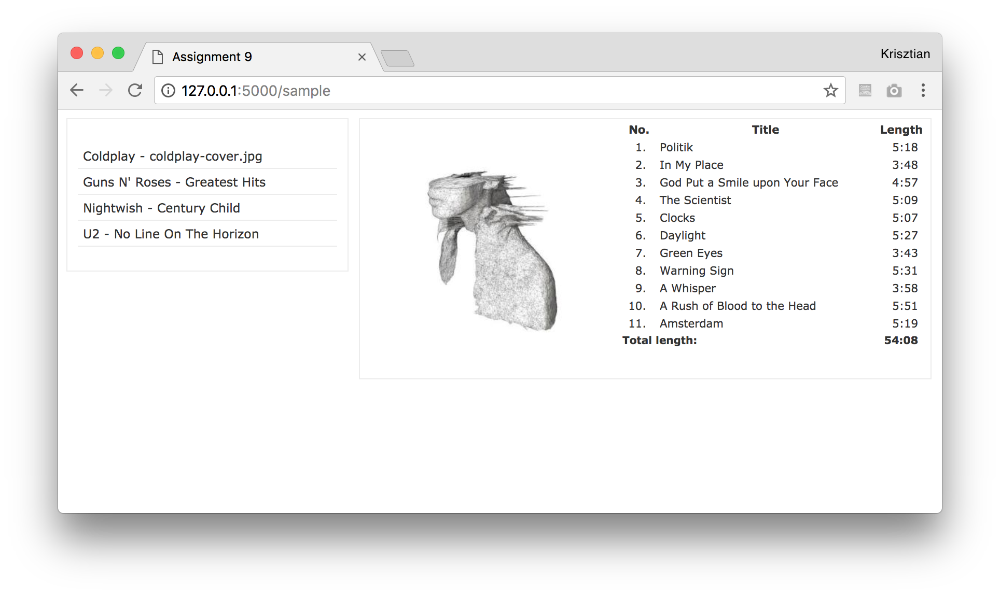

# Assignment 9 - AJAX

Your task is to create a simple web application using AJAX that allows users to browse music albums.

  *	When the user opens the page a list of music albums is displayed. The right panel (`album_info` div) is initially empty.
  *	When clicking on an album, the followings need to be displayed in the right panel (in the `album_info` div):
    -	The album cover
    -	The track list (track number, title, length)
    -	The album's total length (in mm:ss format)
  *	All these operations have to use AJAX, that is, without reloading the entire page. The server-side Python app must send the data in JSON format.

You are provided with the skeleton of the solution which consists of the following files:

  *	`static/index.html` is the page that gets rendered when visiting http://127.0.0.1:5000. You don't need to make changes to this file.
  * `static/index_static.html` is just a static example, which you can see under http://127.0.0.1:5000/sample. It shows how the page should look like once the used has clicked on an album.

  *	`static/style.css` is a style file (can be customized, but it's not part of the task)
  * `app.py` is the Python server-side application.  
    - It includes a class for representing the list of albums. You need to complete the missing parts such that it loads data from the `data/albums.txt` and `data/tracks.txt` files.  You can decide what internal data structure you want to use for storing the data.
    - It is already implemented that a single instance of the Albums class is used, so that loading from the files happens only once (and not for each request).
  *	`scripts.js` is where all JavaScript code should go. You need to parse the JSON responses and update the contents of the corresponding div-s of the index.html file.

Additional information:

  *	You may use JavaScript or jQuery on the client side for making HTTP requests.
  *	The data files are under the data folder in tab-separated format. The tracks within an album should be displayed in the same order as in the file. The order of the albums does not matter.
  *	Supply your application with sample data. Include at least 5 albums with at least 10 songs in each (i.e., you can keep the sample data if you want, but you need to add at least 3 more albums still). Put the album covers inside the `static/images` folder.

Commit and push files to GitHub.

# Øving 9 - AJAX

Oppgaven går ut på å lage en simpel webapplikasjon som lar brukerne bla gjennom musikkalbum ved hjelp av AJAX.

  * Når brukeren åpner siden skal en liste med musikkalbum vises. Det høyreliggende panelet (`album_info` seksjonen) er tomt til å begynne med.
  *	Når det klikkes på et album, skal følgende vises i høyre panel:
    -	Albumcoveret
    -	Spillelisten (Låtnummer, tittel, varighet)
    -	Total varighet (i mm:ss format)
  *	Alle disse operasjonene må bruke AJAX, med andre ord uten å laste inn hele siden på nytt. Python-applikasjonen på serversiden må sende data i JSON format.

Du har fått utdelt et skjelett av løsningen som består av følgende filer:

  *	`static/index.html` er siden som vises når du besøker http://127.0.0.1:5000. Du trenger ikke å gjøre endringer på denne filen.
  * `static/index_static.html` er bare et statisk eksempel som du kan finne under http://127.0.0.1:5000/sample. Den viser deg hvordan siden skal se ut når brukeren har klikket på et album.

  *	`static/style.css` er en stil-fil (kan endres på, men det er ikke en del av oppgaven)
  * `app.py` er serverens Python-applikasjon.
    - Den inkluderer en klasse for å representere en liste med album. Du må fylle inn det som mangler slik at den laster inn data fra `data/albums.txt` og `data/tracks.txt` filene. Du velger selv hvilken datastruktur for lagring av data du vil bruke.
    - Den er allerede implementert slik at én instans av Albums klassen er brukt, så innlasting av filene skjer kun én gang (og ikke ved hvert request)
  * `scripts.js` er hvor all JavaScript koden skal ligge. Du må tolke JSON responsene og oppdatere innholdet i de korresponderende div'ene i index.html filen.

Tilleggsinformasjon:

  *	Du kan bruke JavaScript eller jQuery for å sende HTTP forespørsler fra klientsiden.
  *	Data-filene er under data-mappen i et tab-separert format. Låtene i et album burde vises i samme rekkefølge som i den filen. Albumrekkefølgen er villkårlig.
  *	Tilfør applikasjonen din eksempeldata. Inkluder minst 5 album med minst 10 sanger i hvert album (du kan bruke eksisterende data, men du må uansett legge til 3 ytterligere album). Legg albumcoverene inn under `static/images` mappen.

Commit og push filene til GitHub.
