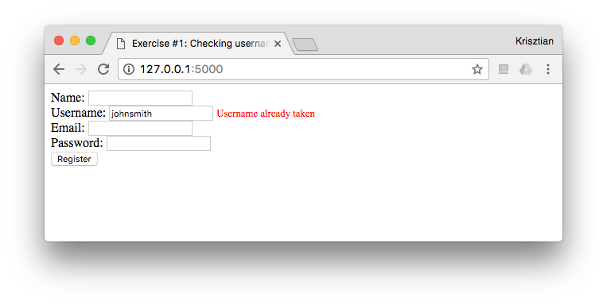
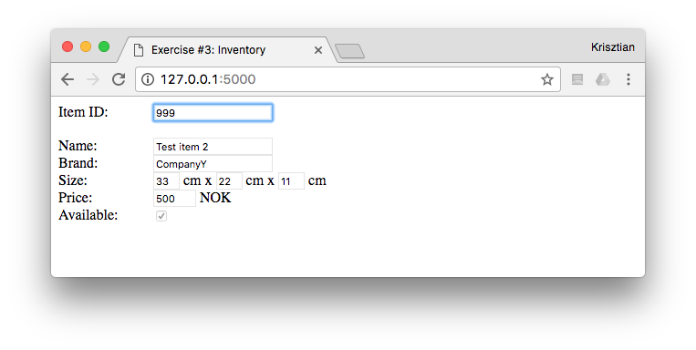

# AJAX exercises

## Exercise #1: Checking username

Check on the registration form whether the given username meets the requirements and is available. This has to be done using AJAX, i.e., without re-loading the page. Use GET for requesting data from the server.

  - Complete the `check_username()` method in the server-side app `app.py` such that it checks that
    * The username is minimum 3 characters long;
    * It contains only alphanumerical characters (letters or digits);
    * It has not been used before (for now a static list contains the used usernames).
  - The check has to be performed each time the username field loses focus (the user tabs or clicks out from the field); edit `exercise1.html` accordingly. Don't display any error message if the username field is empty.
  - The AJAX request and response handling goes to `exercise1.js`. If the response from check_username.php is anything but an empty string, it means there is an error. Write that error string to the span with id `username_status`.




## Exercise #1b: Checking username

Change your solution to Exercise #1 such that the data from the server is requested using POST.


## Exercise #2: Inventory

Assume that there is an inventory database where each item has a 3-digit unique identifier (e.g., `021`, `987`, etc.). For know, this data is stored as a dictionary in `app.py`.

  - Complete the `invertory()` method in `app.py` such that an inventory item can be looked up based on its 3-digit identifier. Return the inventory record as a JSON object. For example `inventory?item_id=123` should return

```
{"name":"Test item","brand":"CompanyX","size_x":11,"size_y":22,"size_z":33,"price":1000,"available":false}
```

  - Complete `exercise2.js` to parse the JSON response and display the values in the corresponding form fields.




## Exercise 3: Checking username

Solve Exercise #1 using jQuery.

Specifically, write the error string returned by the server to the span with id `username_status` using the [load()](http://api.jquery.com/load/) jQuery method.

The static HTML file and the server app are [given](ex_3/). You are not allowed to make changes to these! You only need to complete `exercise3.js`.


## Exercise 4: Inventory

Solve Exercise #2 using jQuery.

The static HTML file and the server app are [given](ex_4/). You are not allowed to make changes to these! You only need to complete `exercise4.js`.
