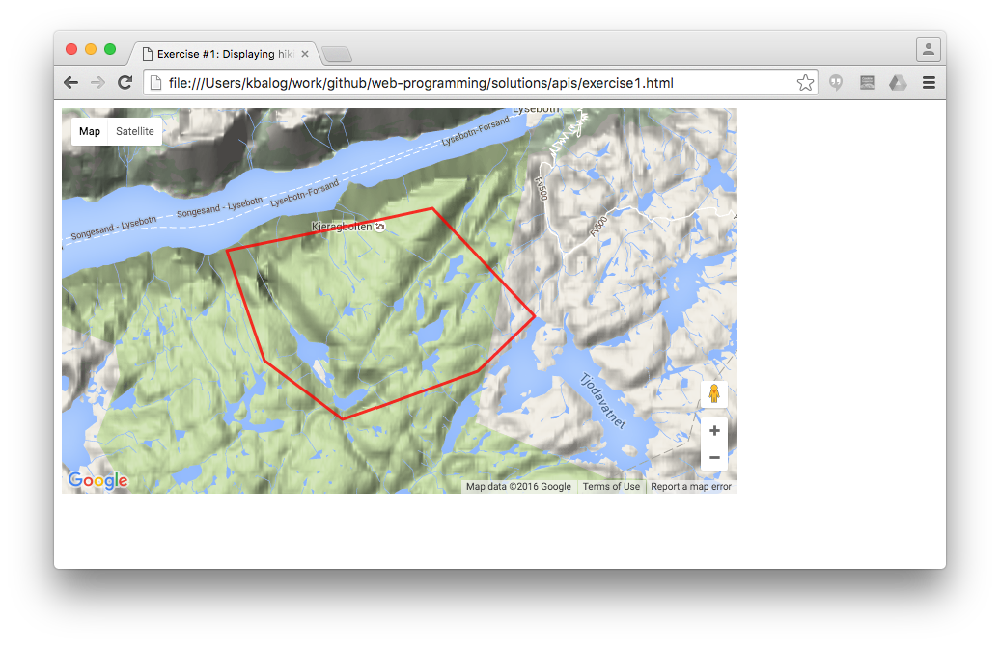
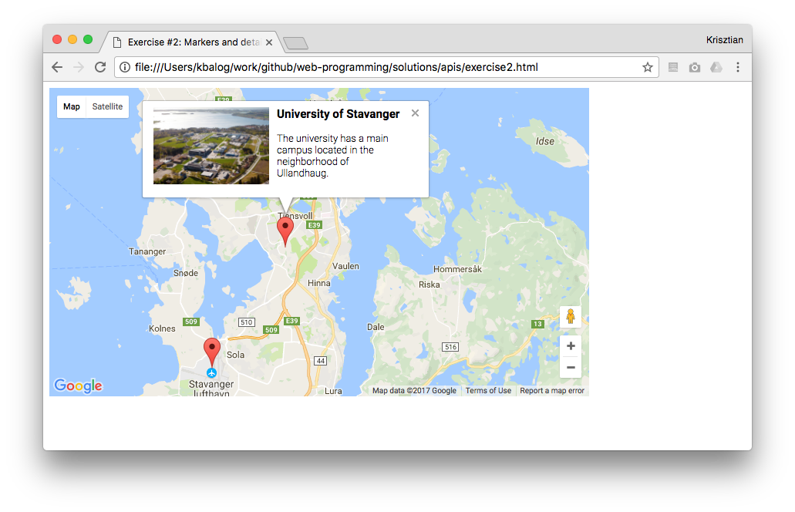
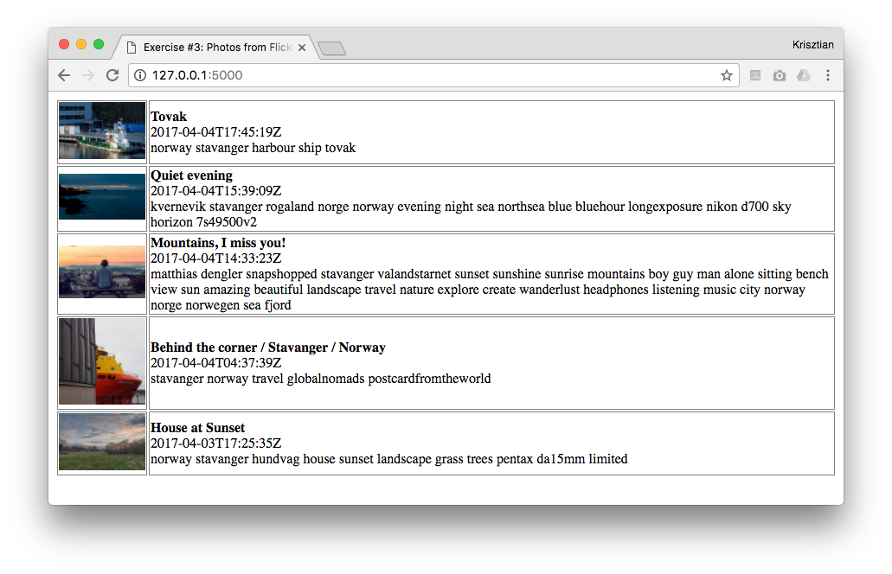
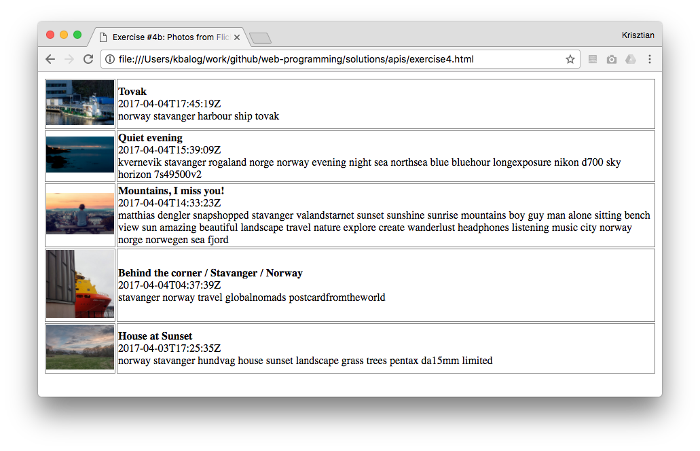

# WEB API exercises

## Exercise #1: Displaying hiking route

Create a map using the Google Maps API that displays a hiking route between a number of different locations. Use a terrain map. The [starter file](exercise1.html) initializes a map.

Hint: you will need to draw a polyline or polygon.

See the [W3C tutorial](https://www.w3schools.com/graphics/google_maps_intro.asp) or the [official Google Maps API documentation](https://developers.google.com/maps/documentation/javascript/) for help.

## Exercise #2: Markers and details

Create a map using the Google Maps API that displays at least two markers and shows some details about the place (photo, name, and description) in an info window.

## Exercise #3: Photos from Flickr

Get 5 recent photos of Stavanger from [Flickr's public feed](https://www.flickr.com/services/feeds/docs/photos_public/) using Python.
Display them in a table title, date, tags, and a link to the photo’s page on Flickr.

The [starter file](exercise3.py) helps you to make a request and load the JSON response into a variable.  Set `params` according to what you need from Flickr, parse out photos from the returned results (`data`), and pass it on to the template. You will also need to complete the corresponding [template file](templates/exercise3.html).

Note: set `nojasoncallback=1` for raw JSON response in the request URL (`http://api.flickr.../photos_public.gne?nojsoncallback=1&param1=value1...`).

## Exercise #4: Photos from Flickr

Solve the previous exercise using only client-side scripting, i.e., jQuery and JSONP.

