# Bootstrap exercises

## Exercise #1: 960.gs

This is not an exercise about Bootstrap (yet).

Complete [exercise1.html](exercise1.html) such that that page displays as shown below:
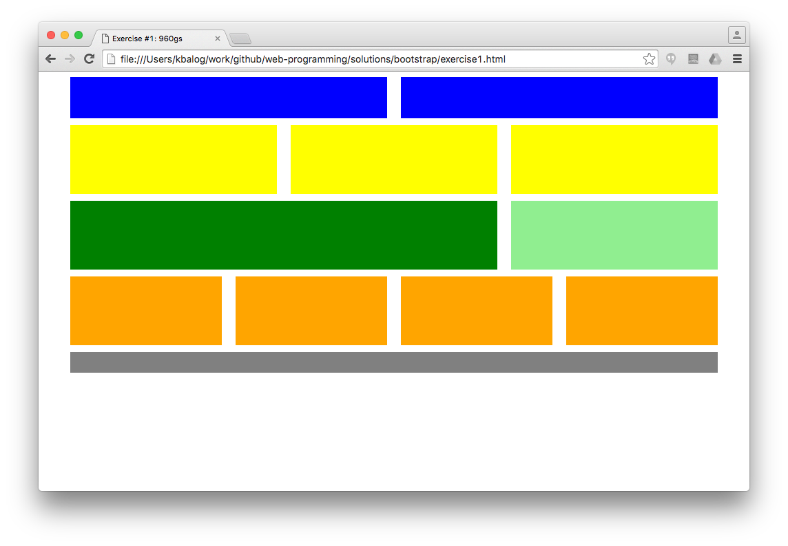

You need to create the boxes using the prepared CSS classes. See [this page](http://960.gs/demo.html) for an example.

Hint: the first (blue) box becomes:

```html
<div class="grid_6">

  <div class="blue"></div>

</div>
```

## Exercise #2: Grid layout

Complete [exercise2.html](exercise2.html) to create the following layout using Bootstrap.
 Start with the mobile view.

Hint: use [responsive classes](http://getbootstrap.com/css/#responsive-utilities) on rows.

Mobile view:
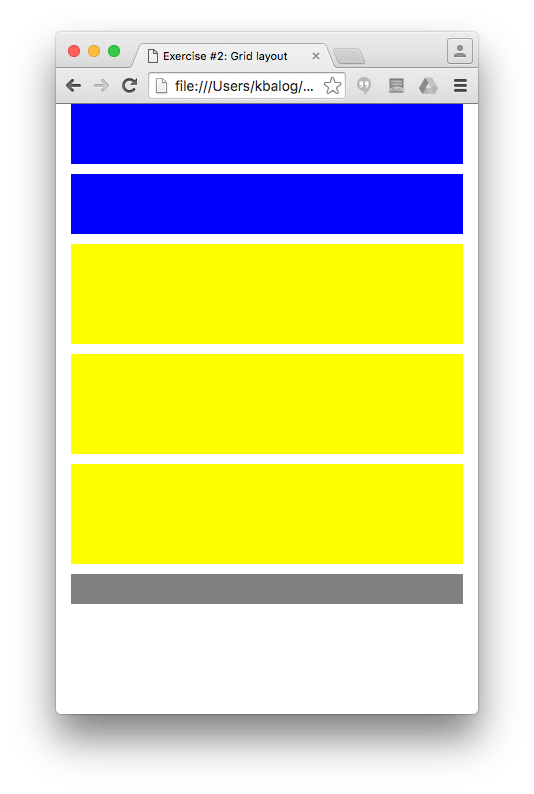

Desktop view:
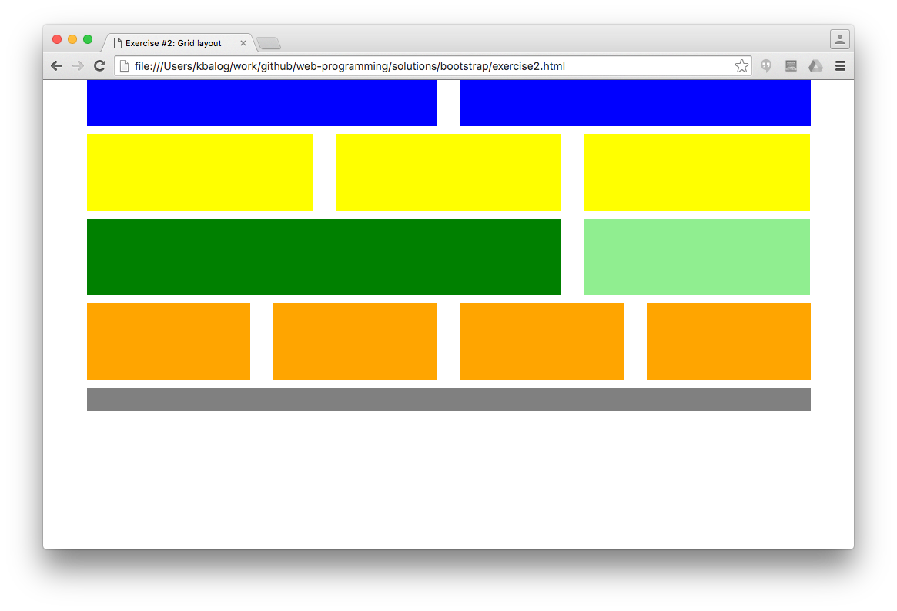


## Exercise #3: Tables

Complete the Bootstrap table exercises from the W3C tutorial: [1](http://www.w3schools.com/bootstrap/exercise.asp?filename=exercise_tables1), [2](http://www.w3schools.com/bootstrap/exercise.asp?filename=exercise_tables2), [3](http://www.w3schools.com/bootstrap/exercise.asp?filename=exercise_tables3), [4](http://www.w3schools.com/bootstrap/exercise.asp?filename=exercise_tables4), [5](http://www.w3schools.com/bootstrap/exercise.asp?filename=exercise_tables5), [6](http://www.w3schools.com/bootstrap/exercise.asp?filename=exercise_tables6).


## Exercise #4: Images

Complete the Bootstrap image exercises from the W3C tutorial: [1](http://www.w3schools.com/bootstrap/exercise.asp?filename=exercise_images1),
[2](http://www.w3schools.com/bootstrap/exercise.asp?filename=exercise_images2), [3](http://www.w3schools.com/bootstrap/exercise.asp?filename=exercise_images3), [4](http://www.w3schools.com/bootstrap/exercise.asp?filename=exercise_images4).


## Exercise #5: Buttons

Complete the Bootstrap button exercises from the W3C tutorial:
[1](http://www.w3schools.com/bootstrap/exercise.asp?filename=exercise_buttons1), [2](http://www.w3schools.com/bootstrap/exercise.asp?filename=exercise_buttons2), [3](http://www.w3schools.com/bootstrap/exercise.asp?filename=exercise_buttons3), [4](http://www.w3schools.com/bootstrap/exercise.asp?filename=exercise_buttons4).


## Exercise #6: Simple form

Style the form given in [exercise6.html](exercise6.html) using Bootstrap. (You will also need to include the Bootstrap css file in the header.) See the [Bootstrap form documentation](http://getbootstrap.com/css/#forms) for help.

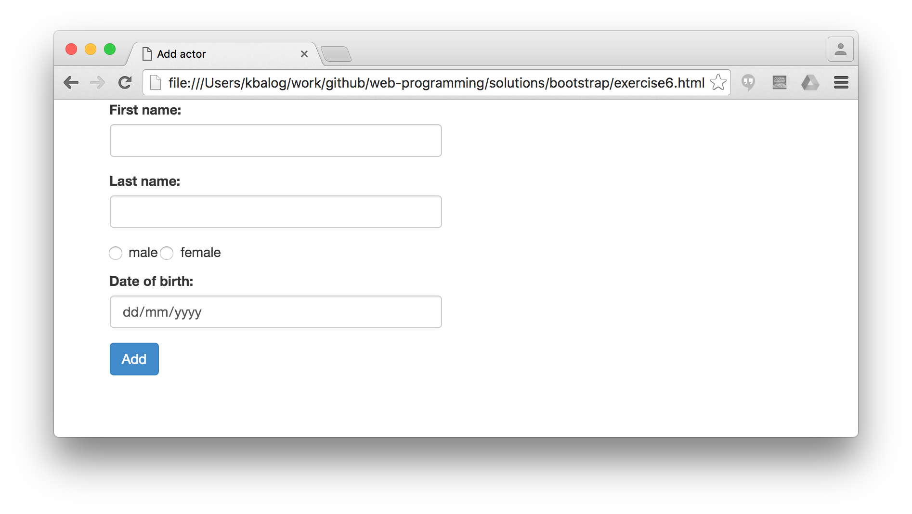


## Exercise #7: Wild & Wacky Vegetables

(Taken from http://www.pairuptocode.com/exercises/bootstrap.html)

Format and extend the given [starer html file](exercise7.html) using Bootstrap by following the steps below.

1) Use the [Bootstrap grids classes](http://getbootstrap.com/css/#grid) to create a sidebar and main content.

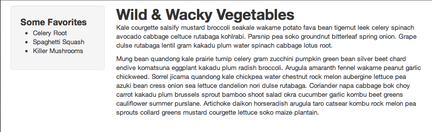

2) Use the [Bootstrap base CSS classes](http://getbootstrap.com/css/#type) to add a quote, table, and search form to the page:

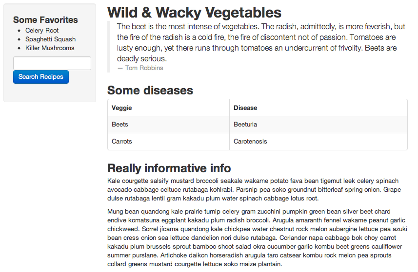

3) Use the [Bootstrap alert component](http://getbootstrap.com/components/#alerts) to add a danger alert. Use the [thumbnails classes](http://getbootstrap.com/components/#thumbnails) to give the images borders.

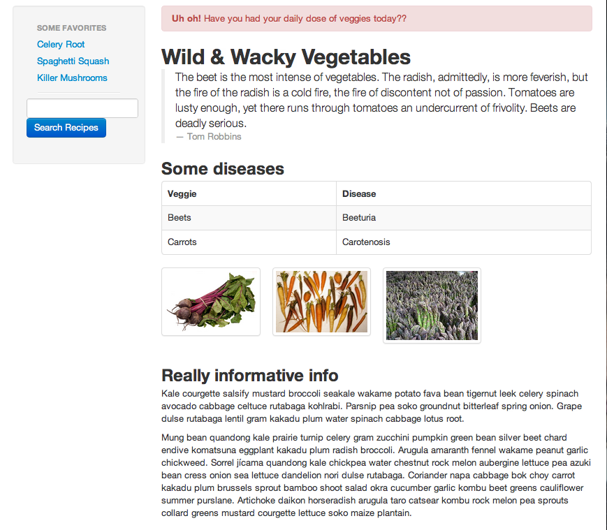


## Exercise #8: Components

Try the different Bootstrap components in action by building the following page step-by-step. There is no starter file for this exercise, you need to code everything from scratch.

1) Add a navigation bar, a full-width jumbotron, and 3 columns with some content.

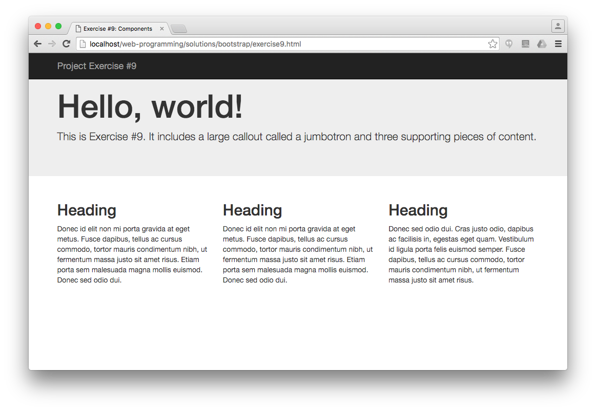

2) Extend the navigation bar with the followings:
  - The navbar should always be fixed on the top of the screen.
  - Add three menu items plus a dropdown menu to the left. Mark the second menu item as active.
  - Add a sign-in form with email and passwords fields to the right.

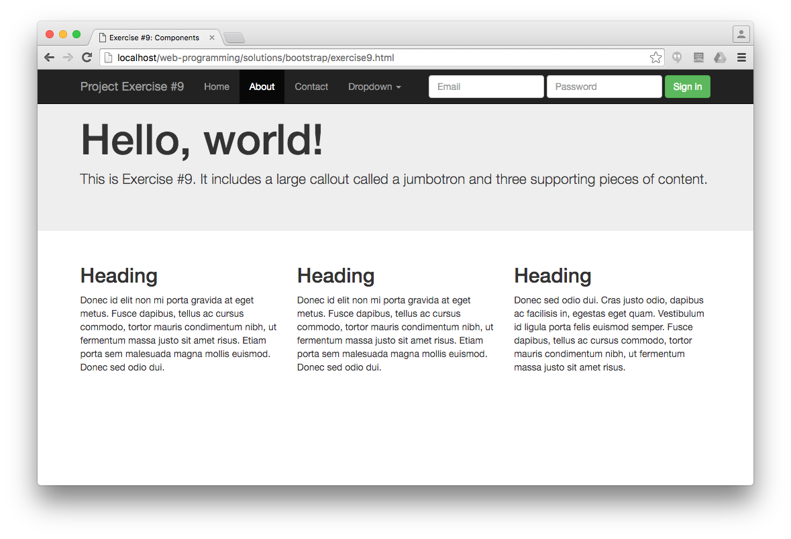
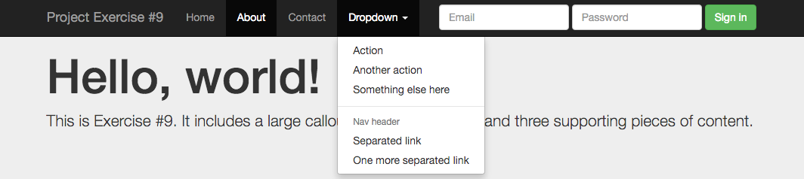

3) Add a primary "Learn more" button to the jumbotron, and "View details" buttons in medium size with different glyphicons under the text blocks in each column.

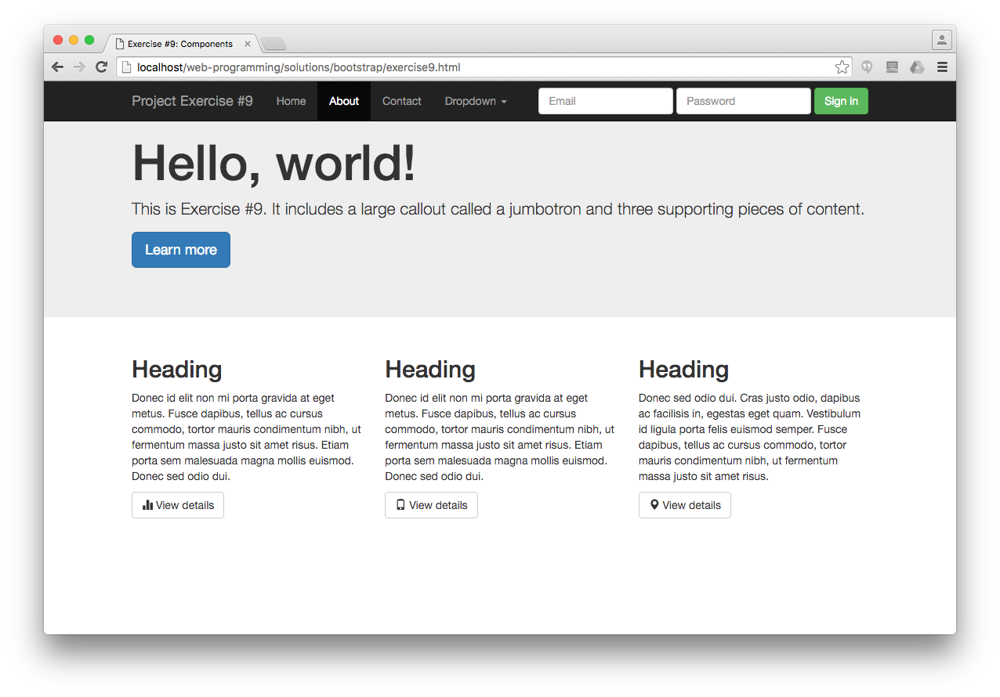

4) Add a dismissable alert below the jumbotron, and a "New" label to the heading in the third column. Further, add a badge with a number to the "Contact" item in the navbar.

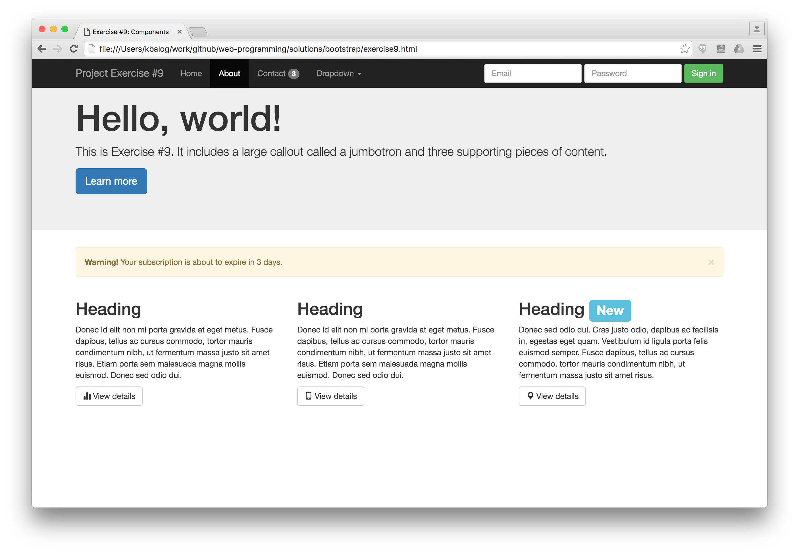
