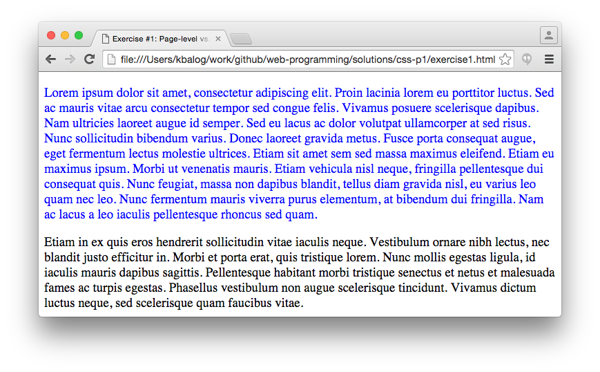
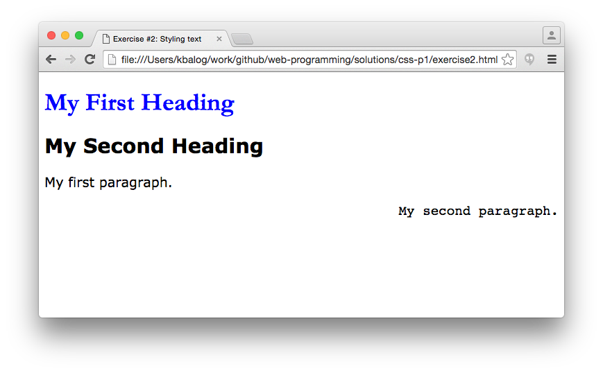
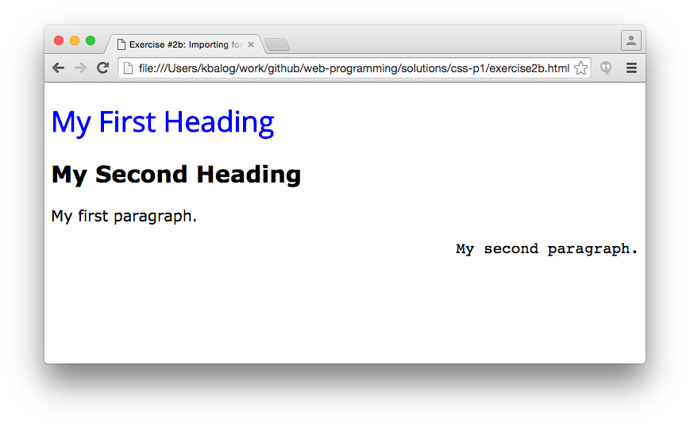
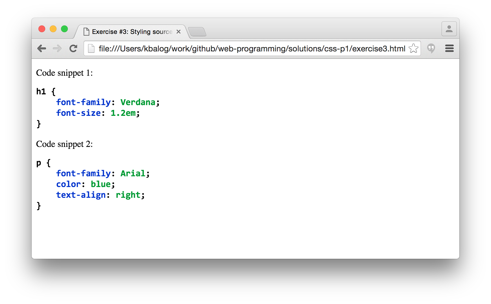
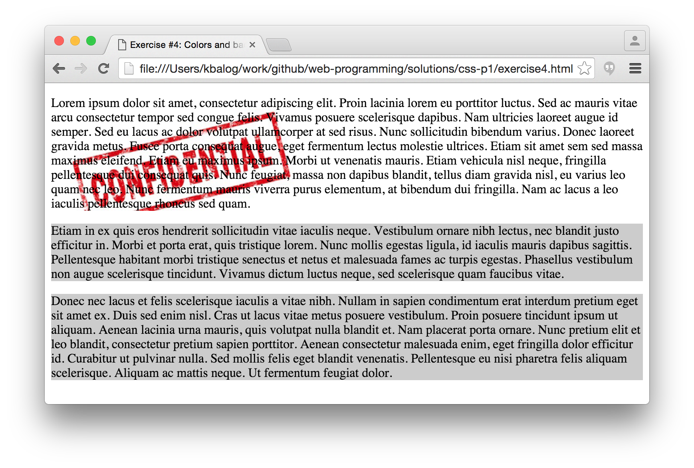
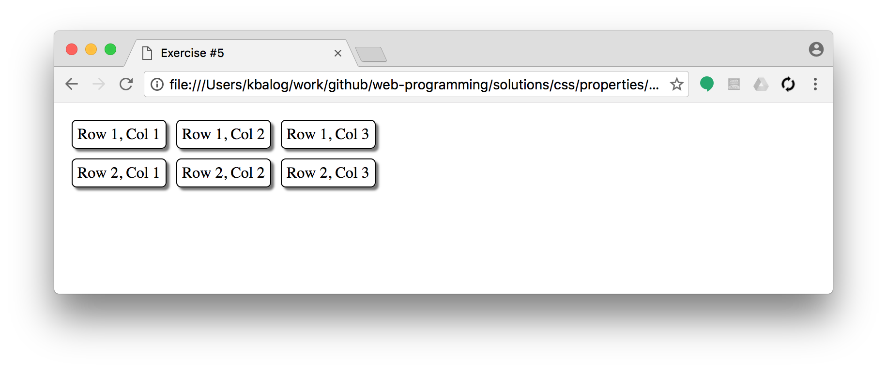

# CSS exercises, Part I. (properties)

## Exercise #1: Page-level vs. inline CSS

  - Take the starting HTML file [exercise1.html](exercise1.html).
  - Change the default paragraph font size to 14pt by adding `font-size: 14pt;` (that is, page-level CSS).
  - Change the font color of the second paragraph to black by defining a style attribute (that is, use inline CSS).

## Exercise #2: Styling text

  - Create a html page with
    * a main heading (h1),
    * a `div` element, with a second-level heading (h2) and two paragraphs in it.
  - Set the fonts, sizes, colors, text alignment using **inline CSS** as follows:
    * main heading to Garamond (with serif as fall-back choice), 36px, blue,
    * div to Verdana,1.2em,
    * second paragraph to Courier and right aligned.

## Exercise #2b: Importing fonts

  - Select a new *sans-serif* font (that is not present on your computer) from [Google Fonts](https://www.google.com/fonts) and change the main header from the previous exercise to that font (i.e., replace Garamond).
    * The screenshot below uses [Open Sans](https://www.google.com/fonts#QuickUsePlace:quickUse)

## Exercise #3: Styling source code

  - Take the starting HTML file [exercise3.html](exercise3.html).
  - Formatting source code text (inside `<pre>`) using **page-level CSS**:
    * Note: the content inside the `<pre>` element is displayed in a fixed-width font, and it preserves both spaces and line breaks.
    * Use `font-family: Consolas, Menlo, Monaco, Courier New, monospace;`.
    * Use a bold font.     
  - Formatting properties using **page-level CSS**:
    * Make the links to the corresponding w3schools page.
    * Set their color to #0033cc.
    * Links should not be underlined by default, only on mouseover.
  - Formatting values using **inline CSS**:
    * Set their color to #009933;
    * Hint: use the `` tag for coloring text.

## Exercise #4: Backgrounds and colors

  - Create a page with three paragraphs of text (you can take Exercise #1).
  - Set the background of all paragraps to using **page-level CSS**.
  - Set the background of the first paragraph to white and add a "confidential" stamp as background using **inline CSS**.
    * The image is _images/confidential.jpg_
    * Use [background-repeat](http://www.w3schools.com/cssref/pr_background-repeat.asp) to have the stamp displayed only once.

## Exercise #5: Advanced table styling

  * Create a table with 2 rows and 3 columns.
  * Set 5px padding for table cells.
  * Have 10px space in between the cells (see [border-spacing](http://www.w3schools.com/cssref/pr_border-spacing.asp)).
  * Set a 1px solid black border for the cells.
  * Pro: use round corners and drop shadow.

