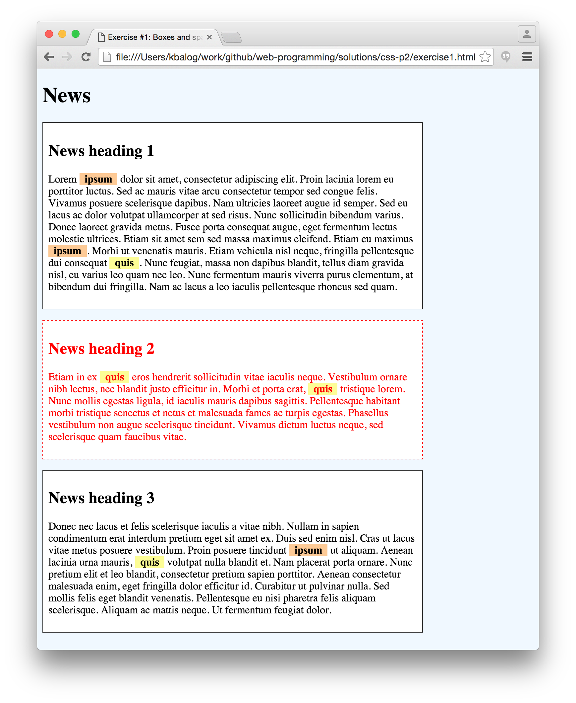
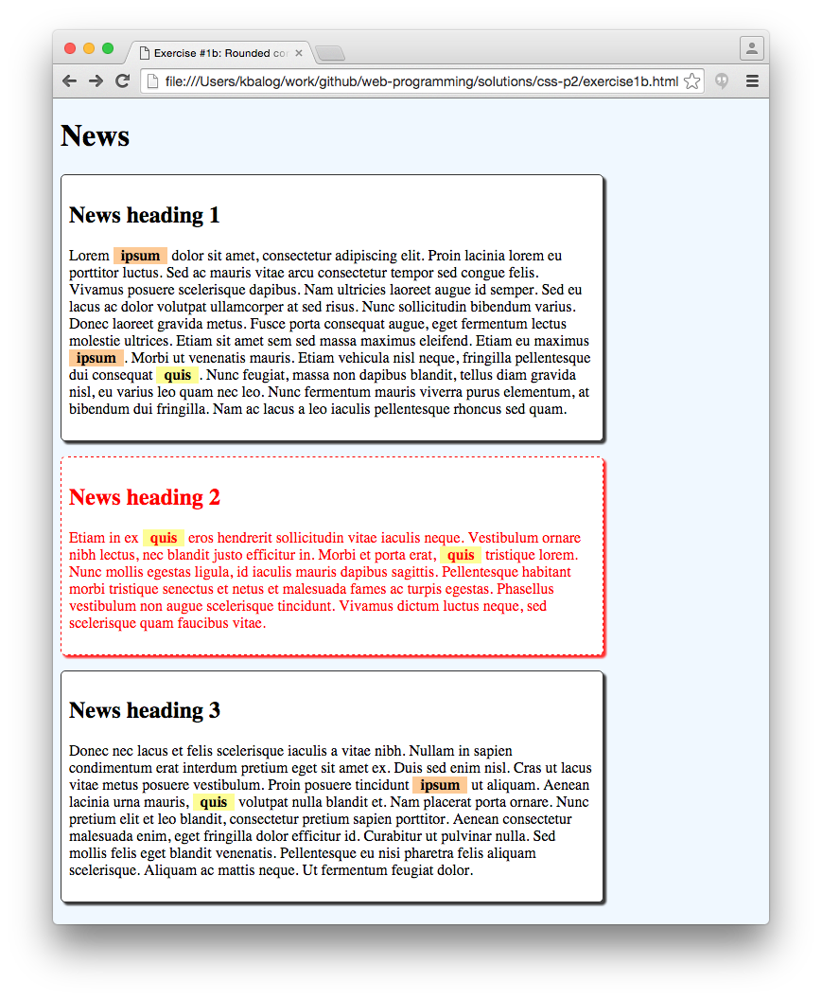
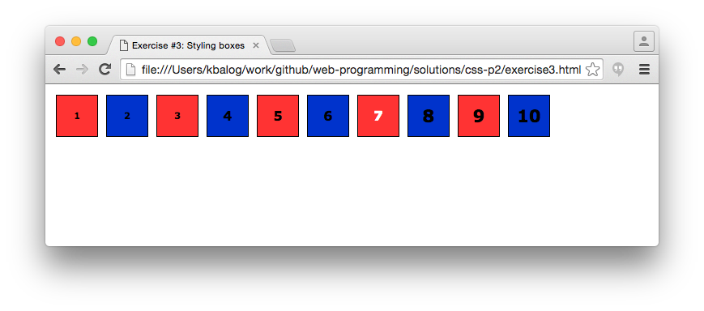
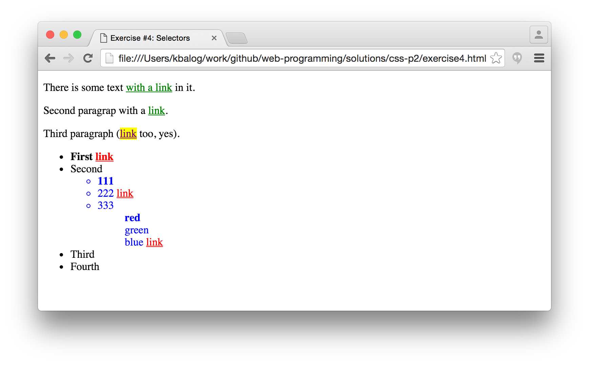

# CSS exercises, Part II. (selectors)

## Exercise #1: Boxes and spacing

Make a HTML page with a main `<h1>` header and three `<div>` blocks, representing news articles.
Each block should have the following structure:

```html
<div>
    <h2>...</h2>
    <p>...</p>
</div>
```

You can copy-paste the HTML from [here](exercise1.html).
      
Style the elements as follows. Unless otherwise stated, use page-level CSS.

  - The page background color is #f0f8ff.
  - Set the width of divs to 75%. Apply a minimum width of 500px. 
    * Check by resizing the browser window that the minimum width is applied: content should not "shrink" further beyond 500px.
  - Apply a 1px width solid border with color #333333 around each news block (div).
  - Set the vertical distance between news blocks to 1em.
  - Set the inner distance between the border and content of news blocks to 0.5em.
  - Set the background of the news blocks to white.
  - Set the border to dashed and red around the second news article using inline CSS.
  - Set all text to red inside the second news article using inline CSS.
  - Select two words ("ipsum" and "quis" in the example) that will be highlighted (use the `<span>` tag around these words): 
    * Set the font to bold, and add an extra 0.5em space on the left and right of the highlighted words (by setting left and right padding).
    * Use a separate background color for the two words (e.g., #fdfd96 and #fdca96) using inline CSS.




## Exercise #1b: Rounded corners and shadows

Extend the previous exercise with the following:

  - Add shadow to the news blocks (divs). The box with the red border should get a red shadow.
  - Make the corners of the news blocks (divs) rounded.




## Exercise #2: IDs and classes

  - Change Exercise #1 such that it displays exactly as before, but all inline CSS is removed (replaced by IDs or classes), and all CSS is moved to an external `exercise2.css` file.
    * Add the following inside `<head>` to link the external style sheet: `<link rel="stylesheet" href="exercise2.css" />`
  - Introduce an ID (`alert`) for formatting the second paragraph.
  - Introduce classes for the different highlight background colors (`hl1`, `hl2`).


## Exercise #3: Styling boxes

  - Check the [starter file](exercise3.html): it displays 10 squares next to each other.
  - Make the classes and apply them on the squares such that:
    * Even squares are blue (#0033cc), odd squares are red (#ff3333).
    * Numbers 1..3 have size 0.7em and numbers 8..10 have size 1.3em (numbers 4..7 have the default size 1em, there is no need to create an extra class for that).
  - Assign the id `lucky7` to square number 7 and change the text color to white.




## Exercise #4: Selectors

Complete the external css file `exercise4.css`. 

  - You are not allowed to make any changes to the HTML file (i.e., cannot add classes or IDs)!
  - The second and third level lists are blue.
  - Items in the third level list are not marked.
  - The first element of each list is bold-faced.
  - The links inside the list should be red; the links outside the lists should be green.
  - The link in the second div should be purple with a yellow background.




## Exercise #5: Specificity calculation

Compute the specificity scores

  1. `* { }`
  1. `li { }`
  1. `li:first-line { }`
  1. `ul li { }`
  1. `ul ol+li { }`
  1. `h1 + *[rel=up] { }`
  1. `ul ol li.red { }`
  1. `li.red.level { }`
  1. `style=""`
  1. `p { }`
  1. `div p { }`
  1. `.sith`
  1. `div p.sith { }`
  1. `#sith`
  1. `body #darkside .sith p { }`
  
  