# HTML exercises

## Exercise #1: Hello world

Copy-paste the following snippet to a text editor and save it as exercise1.html.
Then open the file with any web browser (e.g., Firefox, Chrome, or Internet Explorer).

```html
<!DOCTYPE html>
<html>
<head>
    <title>Exercise #1</title>
</head>
<body>
	Hello world!
</body>
</html>
```


## Exercise #2: Headings and paragraphs

Create the following HTML page. You can use a text editor or the [w3schools try-it editor](http://www.w3schools.com/html/tryit.asp?filename=tryhtml_intro).

  - The headings should be `<h1>`, `<h2>`, and `<h3>` (don't forget the closing tags!)
  - The paragraph text should be inside `<p>..</p>`.

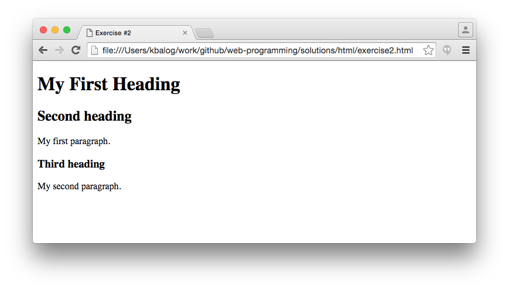


## Exercise #3: Text formatting

Create the HTML page below.

  - Hint: use `<hr>`, `<br>`, `<strong>`, `<s>`, `&nbsp;`, `&euro;`.

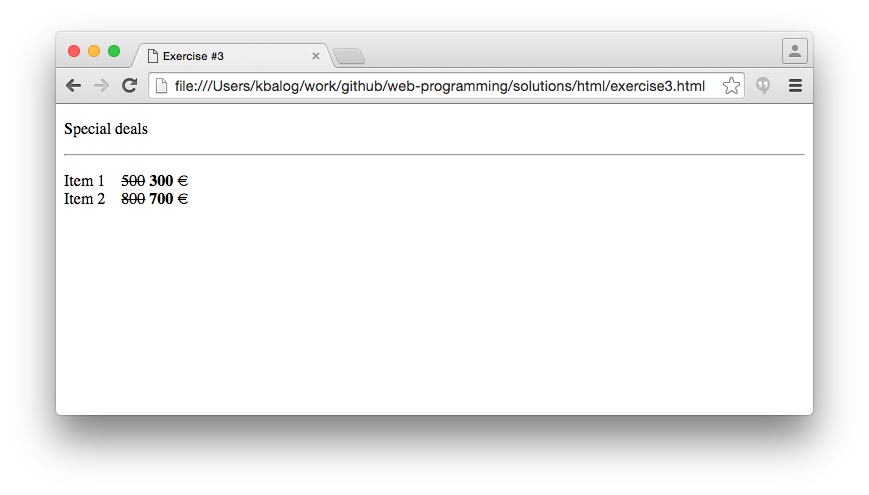


## Exercise #4: Lists

Create an ordered list nested inside an unordered list.

  - Tags to use: `<ol>`, `<ul>`, `<li>`.

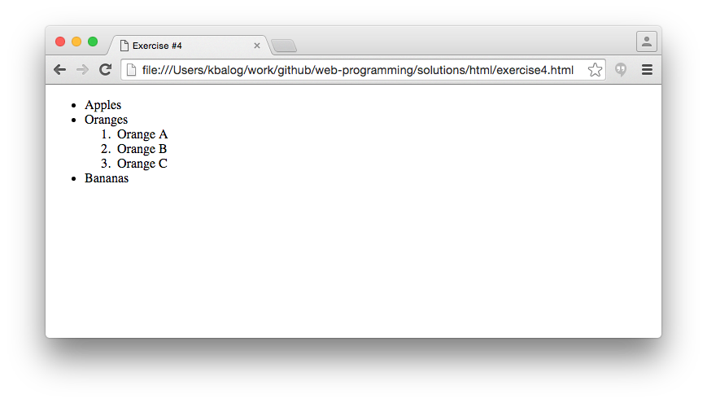


## Exercise #4b: Advanced lists

Building on the previous exercise, make the following changes:

  - Use squares as list markers (instead of bullets) for the unordered list.
  - Use roman lowercase numbers for numbering the nested ordered list.
  - Add another nested list under "Orange C", with three items (red, green, blue), numbered with uppercase letters. The numbering should start with "Z" and go in descending order (Z, Y, X, ...).
  - See [this page](http://www.w3schools.com/html/html_lists.asp) for how to change list markers.
  - See [this page](http://www.w3schools.com/tags/tag_ol.asp) for reference on ordered lists.

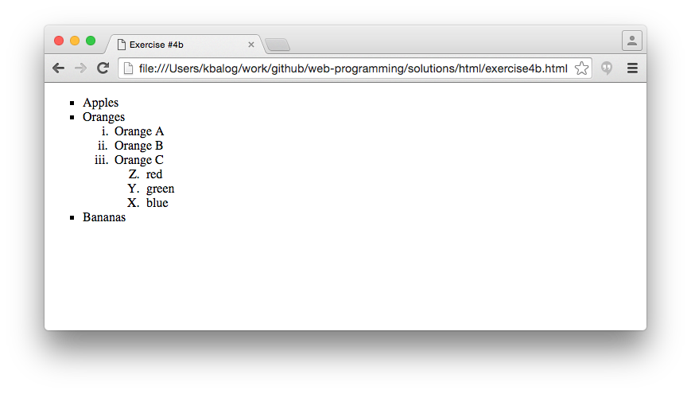


## Exercise 5: Tables

Create the tables below.

  - Add border for better visibility: `<table border="1">`.
  - Tags to use: `<table>`, `<thead>`, `<tbody>`, `<tr>`, `<th>`, `<td>`.

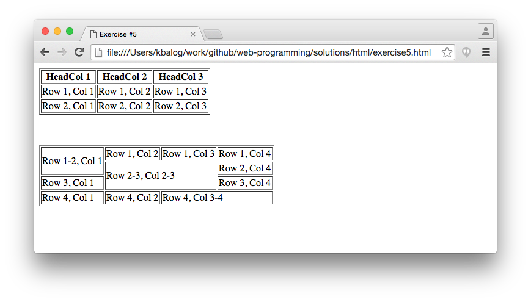


## Exercise #6: Links

Create the HTML page below.

  - The first link points to _http://www.uis.no_.
  - The second link points to _https://google.com_ and opens it in a new window.
  - The third link opens an e-mail to _contact@address.com_.

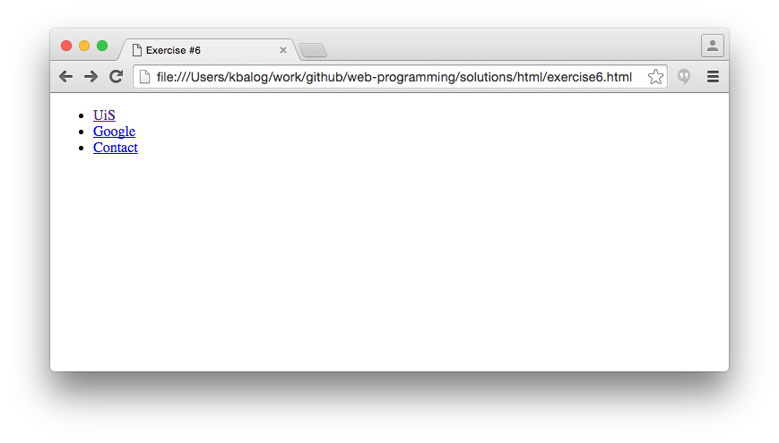


## Exercise #7: Table of contents

Create a table of contents for Exercises #1-#6.

  - The header (`<h1>`) says _Exercises #1-#6_.
  - The table has a header and three columns.
  - The links should open in a new window.

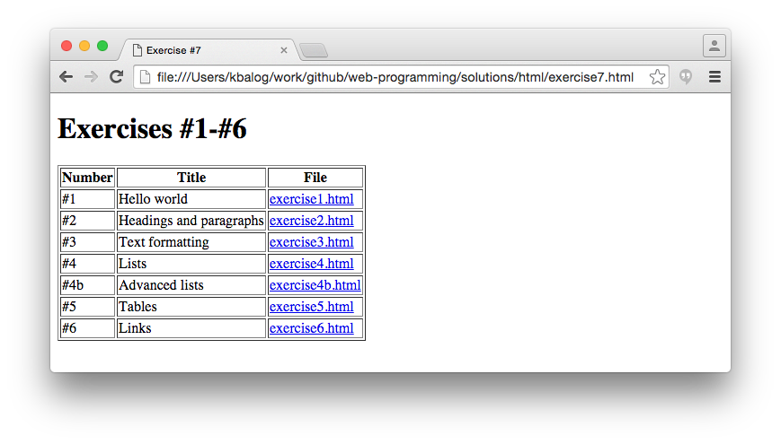


## Exercise #8: Links within a page

Make a HTML page with a several paragraphs of text, such that the content doesn't fit on the screen and requires scrolling.
(In situations, when only some placeholder text is needed, web developers commonly use Lorem Ipsum as a dummy filler text. There are many websites for generating blocks of lorem ipsum text, e.g., [lipsum.com](http://www.lipsum.com/).)

  - Add a link at the top that jumps to the bottom of the page.
  - Add a link at the bottom that jumps to the top of the page.


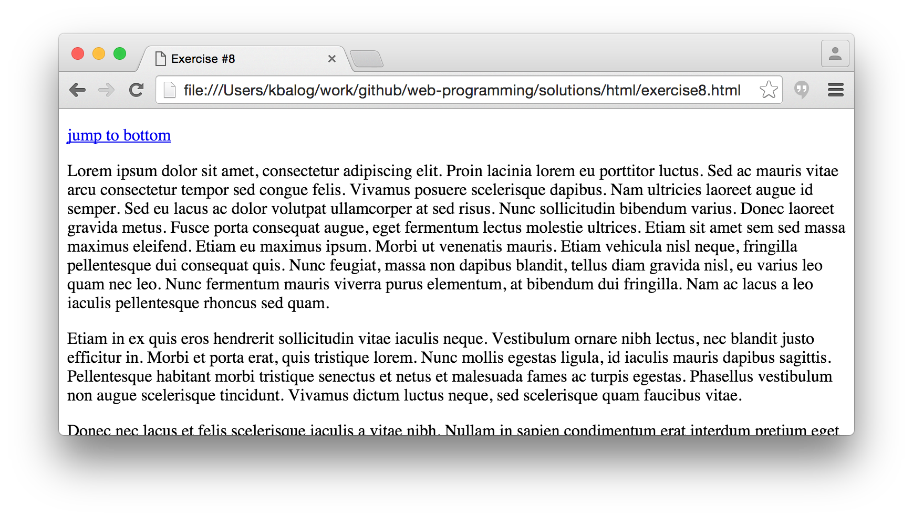
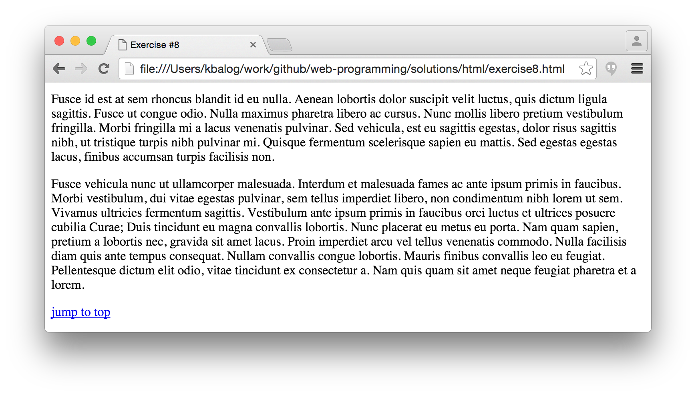


## Exercise #9: Images

For this exercise and the next, you'll need to save the files on your local computer (i.e., won't work with the w3school try-it editor).

  - Make an _images_ folder and save [images/octocat.png](images/octocat.png) in that folder.
  - Create a HTML page and include this image in three different sizes:
    * The original size.
    * 25% of the original size.
    * Setting the height of the image to 50px.
  - Make each each image a link (surround `` with `<a>..</a>`)
    * The first image should point to _github.com_.
    * The second and third images should point to the original image and open in a new window.

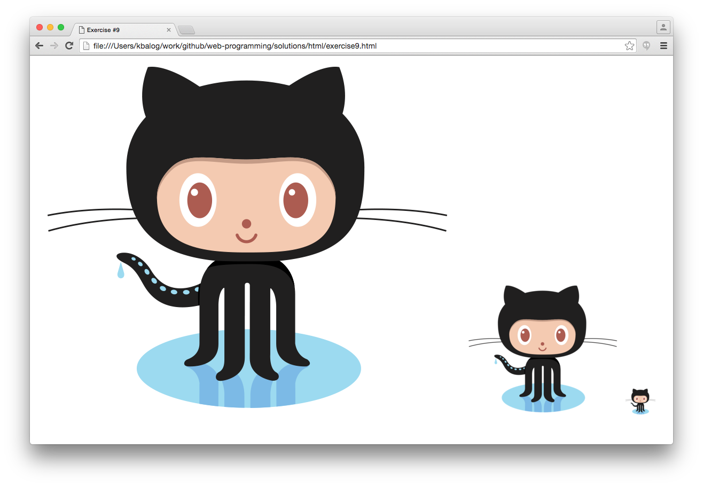


## Exercise #10: Images from the Web

Make a table with the top-3 places you would like to visit.

  - Create thumbnails of the original images on your local computer.
    * Save the original images to your computer then resize them. Resizing can be done, e.g., with Microsoft Paint ([see how](http://www.wikihow.com/Resize-an-Image-in-Microsoft-Paint)).
    * Make all thumbnails of the same size.
  - Links the thumbnails to the original images.
  - Link the name of the place to a page about that place (e.g., Wikipedia).

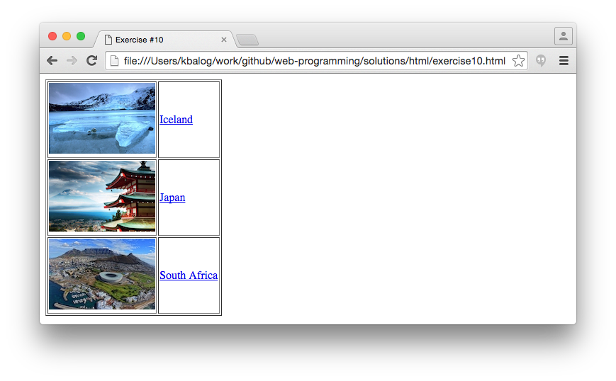


## Exercise #11: Your final test

Create the following HTML page:

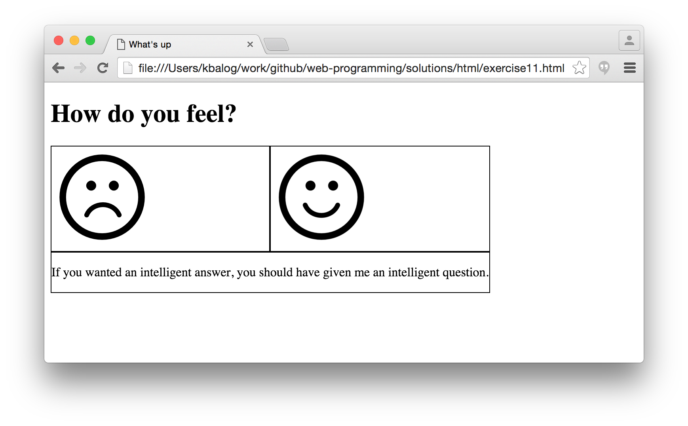

  - The page title is "What's up".
  - The text "How do you feel?" is heading 1.
  - The rest of the content is arranged in a 2-by-2 table.
  - The top row contains one image per cell.
    * Display the images in 128x128px size.
    * The image files, _sadface.png_ and _happyface.png_, are located under the _images_ folder.
    * Put links on the images that point to _http://sadsite.com_ and _http://happysite.com_.
    * The links should open in a new browser window.
  - The cells in the bottom row are merged together and contain a paragraph with the text "If you wanted an intelligent answer, you should have given me an intelligent question."
  - You don't need to use any CSS in this exercise! (The table borders in the figure are just for illustration.)


## Exercise #12: Your favorite YouTube videos

  - Structure the content of the page using HTML5 elements
  - Make a `<header>` element for the page title "My favorite YouTube videos" (which should be in `<h1>`)
  - Code a `<nav>` element that contains the links to videos. Clicking on a link should jump to that video within the page.
  - Make a `<main>` element that contains three `<article>` elements.  Each article should contain
    * A title in `<h2>`
    * An embedded YouTube video (using `<iframe>`)
  - Configure the `<footer>` element to contain a copyright notice displayed in small font size.

  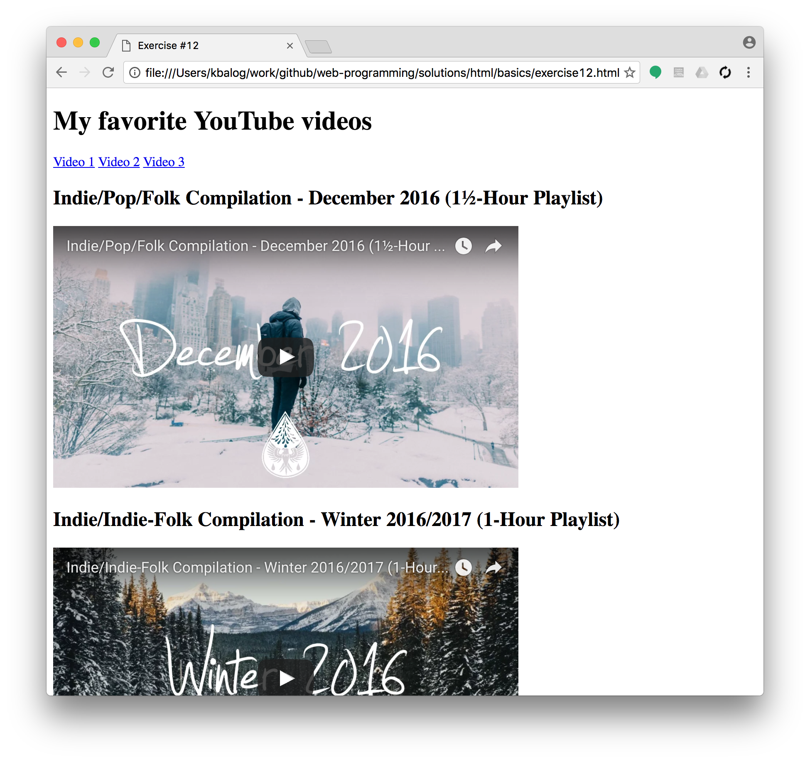
