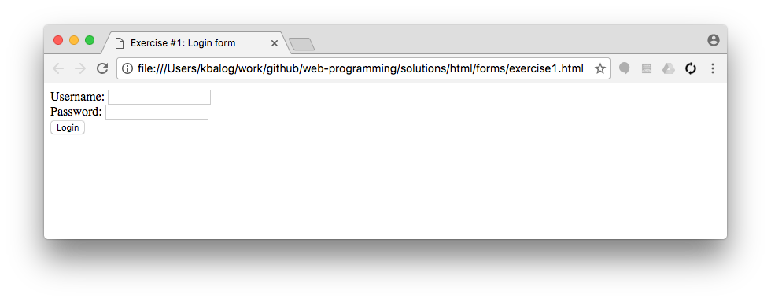
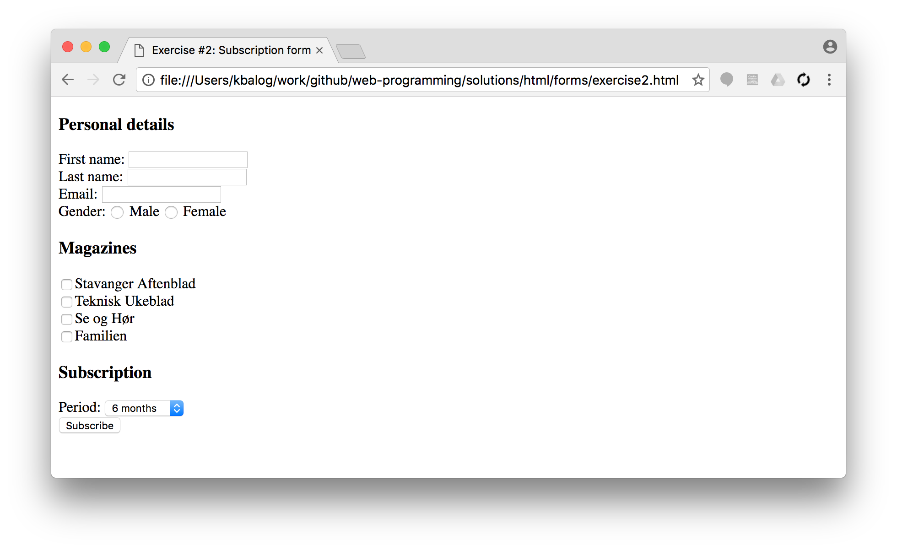
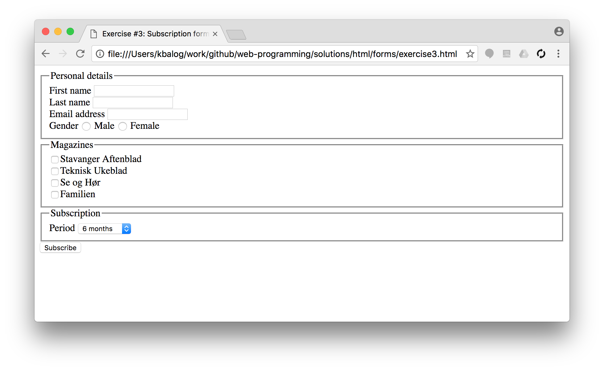
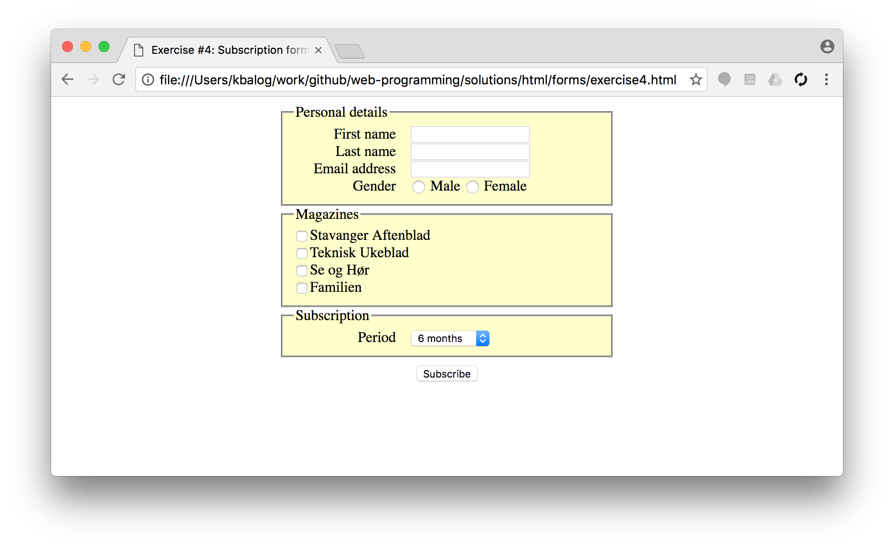

# HTML forms

## Exercise #1: Login form

  - Create a login form with two fields and a submit button
  - The first field is called `username`.
  - The second field is called `pw`.
  - The submit button should have the label _Login_.
  - Leave the `action` attribute of the form empty

  

## Exercise #1b: Sending form data

  - Set the `action` of the previous form to `http://www3.ux.uis.no/~balog/dat310/formtest.php`.
  - Check what happens upon submitting the form.
  - Which form `method` should you use in this case: `GET` or `POST`?

## Exercise #2: Subscription form

Create the form below.

  - Personal details:
    * First and last name as text inputs, email address as input type email.
    * Gender (male/female) as radio buttons (by default none of them is selected).
  - List of magazines to be selected with checkboxes.
  - Subscription period as a select list: 6, 12, 18, or 24 months.
  - The submit button is labeled as _Subscribe_.

## Exercise #3: Subscription form (2)

  - Extend the form you created in the previous exercise.
  - Label the fields using `<label>`.
    * Because of the follow-up exercise, keep labels *separate from the form control* and use the `for` attribute.
  - Group the fields using `<fieldset>`.
  - Add a hidden field `campaign_id`.
  - Set the form action to `http://www3.ux.uis.no/~balog/dat310/formtest.php` and check what happens upon submission.

## Exercise #4: Subscription form (3)

- Use css to style the form you created in the previous exercise:
  * Set a fixed width for the fieldsets, apply a background color, and align them in the middle of the page.
  * Align the fields. (Hint: you can set the width property of the `<label>` tag.)
  * Align the submit button in the middle of the page.

## Exercise #5: HTML5 form elements

Try some of the other [HTML5 input types](www.w3schools.com/html/html_form_input_types.asp), e.g., color, url, search, date, etc.
How are these displayed in different browsers?
