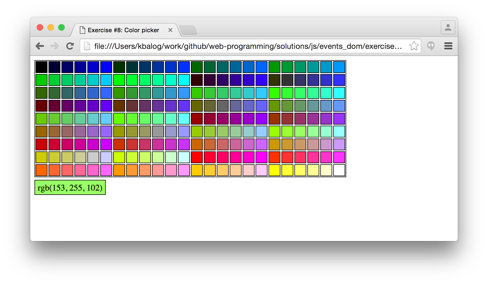
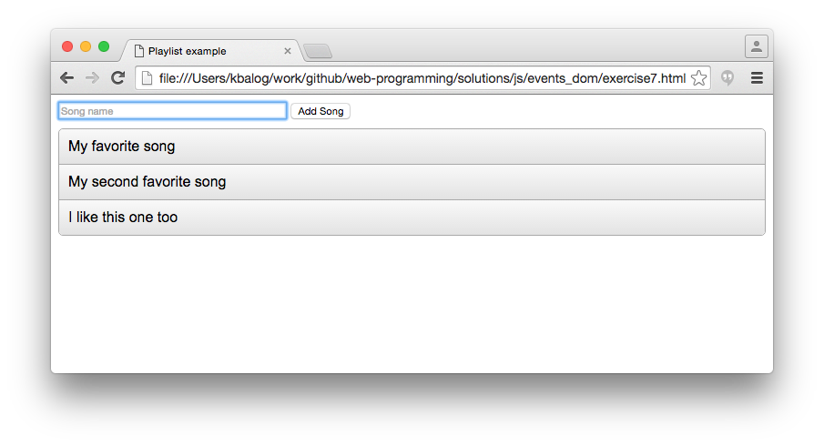
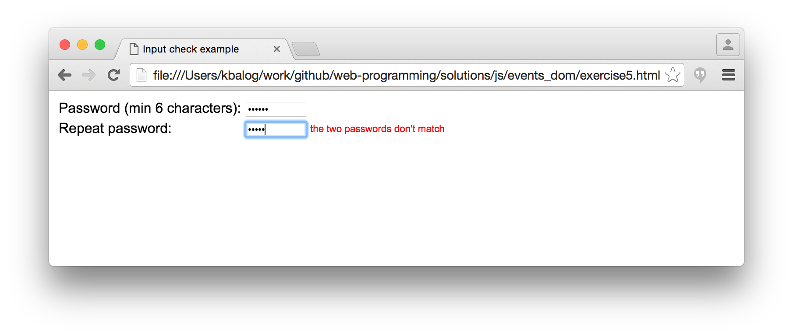
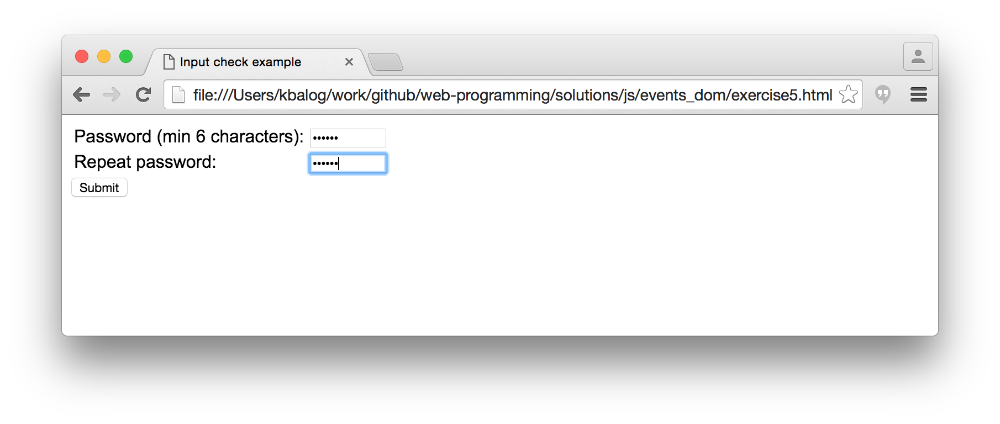
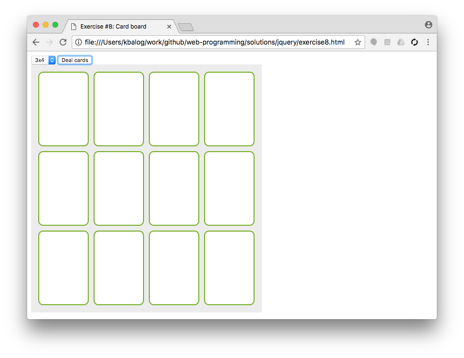
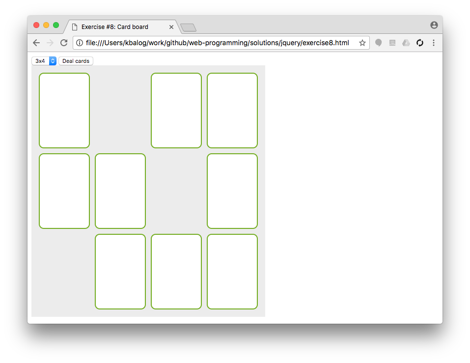
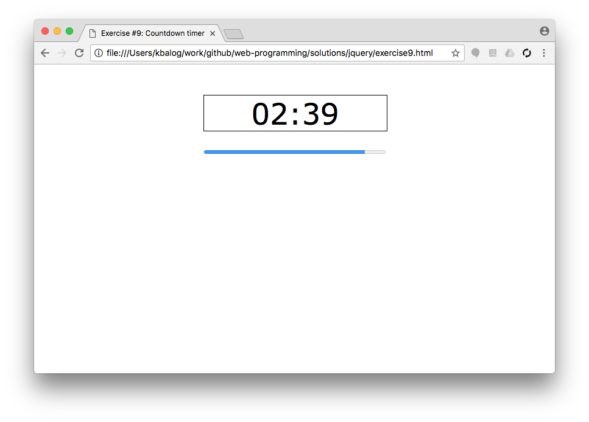

# jQuery exercises

## Exercise #1: Selectors

Complete the jQuery selector exercises from the W3C tutorial: [1](http://www.w3schools.com/jquery/exercise.asp?filename=exercise_selectors1), [2](http://www.w3schools.com/jquery/exercise.asp?filename=exercise_selectors2), [3](http://www.w3schools.com/jquery/exercise.asp?filename=exercise_selectors3), [4](http://www.w3schools.com/jquery/exercise.asp?filename=exercise_selectors4), [5](http://www.w3schools.com/jquery/exercise.asp?filename=exercise_selectors5), [6](http://www.w3schools.com/jquery/exercise.asp?filename=exercise_selectors6).

  - The task is to replace the "selector" part in `$("selector").hide();` with the appropriate selector.
  - See [this page](http://www.w3schools.com/jquery/jquery_ref_selectors.asp) for the list of possible selectors.

## Exercise #2: Events

Complete the jQuery event exercises from the W3C tutorial: [1](http://www.w3schools.com/jquery/exercise.asp?filename=exercise_events1), [2](http://www.w3schools.com/jquery/exercise.asp?filename=exercise_events2), [3](http://www.w3schools.com/jquery/exercise.asp?filename=exercise_events3), [4](http://www.w3schools.com/jquery/exercise.asp?filename=exercise_events4), [5](http://www.w3schools.com/jquery/exercise.asp?filename=exercise_events5).

  - The task is to replace the "selector" and "event" parts in `$("selector").event(function(){`.
  - See [this page](http://www.w3schools.com/jquery/jquery_ref_events.asp) for the list of possible events.

## Exercise #3: HTML/CSS methods

Complete the following selected exercises from the W3C tutorial: [1](http://www.w3schools.com/jquery/exercise.asp?filename=exercise_get1), [2](http://www.w3schools.com/jquery/exercise.asp?filename=exercise_get3), [3](http://www.w3schools.com/jquery/exercise.asp?filename=exercise_set1), [4](http://www.w3schools.com/jquery/exercise.asp?filename=exercise_set3), [5](http://www.w3schools.com/jquery/exercise.asp?filename=exercise_set5), [6](http://www.w3schools.com/jquery/exercise.asp?filename=exercise_add1), [7](http://www.w3schools.com/jquery/exercise.asp?filename=exercise_remove3), [8](http://www.w3schools.com/jquery/exercise.asp?filename=exercise_cssclasses1), [9](http://www.w3schools.com/jquery/exercise.asp?filename=exercise_css1), [10](http://www.w3schools.com/jquery/exercise.asp?filename=exercise_css4).

  - See [this page](http://www.w3schools.com/jquery/jquery_ref_html.asp) for the list of possible HTML/CSS methods.

## Exercise #4: Effect methods

Complete the following selected exercises from the W3C tutorial: [1](http://www.w3schools.com/jquery/exercise.asp?filename=exercise_hide1), [2](http://www.w3schools.com/jquery/exercise.asp?filename=exercise_hide4), [3](http://www.w3schools.com/jquery/exercise.asp?filename=exercise_fade1), [4](http://www.w3schools.com/jquery/exercise.asp?filename=exercise_fade4), [5](http://www.w3schools.com/jquery/exercise.asp?filename=exercise_slide), [6](http://www.w3schools.com/jquery/exercise.asp?filename=exercise_slide3), [7](http://www.w3schools.com/jquery/exercise.asp?filename=exercise_animate1), [8](http://www.w3schools.com/jquery/exercise.asp?filename=exercise_animate2), [9](http://www.w3schools.com/jquery/exercise.asp?filename=exercise_animate3), [10](http://www.w3schools.com/jquery/exercise.asp?filename=exercise_animate4).

  - See [this page](http://www.w3schools.com/jquery/jquery_ref_effects.asp) for the list of possible effect methods.

## Exercise #5: jQuery color picker

Solve the previous JavaScript exercise ([JS II / Exercise #8](../../solutions/js/events_dom/exercise8.js)) using jQuery.

  - Make a color picker that displays a color palette; display colored tiles (rectangles) in the "colors" div.
  - When a colored tile is clicked:
    * write the code of that color inside the "selected" div;
    * set the background of the "selected" div to that color.
  - You are given the [HTML file](exercise5.html) and [part of the JS code](exercise5.js) that collects the different colors in an array. (Only the JS file needs to be edited.)

## Exercise #6: Playlist

Solve the previous JavaScript exercise ([JS II / Exercise #7](../../solutions/js/events_dom/exercise7.js)) using jQuery.

  - Create a simple playlist application where users can add songs to a list. The song here is just a non-empty string.
  - The [starter HTML file](exercise6.html) contains the form and an empty playlist.  There is an [external CSS file](exercise6.css) with the style declarations.
  - Add your solution to [exercise6.js](exercise6.js). You are not allowed to make changes to the html file!

## Exercise #7: Input check

Solve the previous JavaScript exercise ([JS II / Exercise #5](../../solutions/js/events_dom/exercise7.js)) using jQuery.

  - You are [given a form](exercise7.html) with two password fields and a submit button.
  - Perform input check and display an error message next the the corresponding field if there is an error.
    * Passwords must be at least 6 characters long.
    * The two passwords must match.
  - The placeholders for the error messages have already been prepared (div-s with class "err").
  - By default the submit button should be hidden. Display the button only when there are no errors.

## Exercise #8: Card board

  - When the "Deal cards" button is pressed, create cards and place them  in a grid layout, as specified in the select list (the format is `sizeCols x sizeRows`).
  - Adjust the board's width dynamically according to the layout (such that the grey background doesn't extend to the full width of the page).
    * I.e., the width of the `cardboard` div should be set to `sizeCols * cardWidth` px, where `cardWidth` includes border and margin.
  - By clicking on a card, it should disappear with some effect, while leaving its original place empty.
    * Hint: Mind that cards are dynamically created elements. Static event binding using `click()` will not work. Check out the [on() method](https://api.jquery.com/on/).
  - The HTML and CSS files are already written, and you are not allowed to make changes to these.

# Exercise 9: Countdown timer

  - Make a countdown timer that counts back from the selected time. Check the starting files ([exercise9.html](exercise9.html) and [exercise9.js](exercise9.js)) which already provide you with a select list and jQuery code for processing the user input.
  - Show in large text the remaining time in MM:SS format and update the counter with each second elapsed.
  - In addition, show the remaining time in a progress bar.
    * Use the [HTML5 progress element](https://www.w3schools.com/tags/tag_progress.asp) (but remember to progress "backwards").
  - Display an alert when the time is up.

