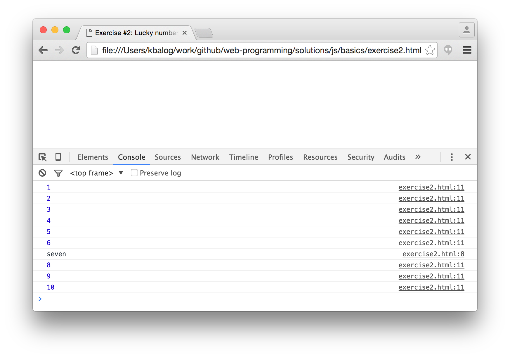
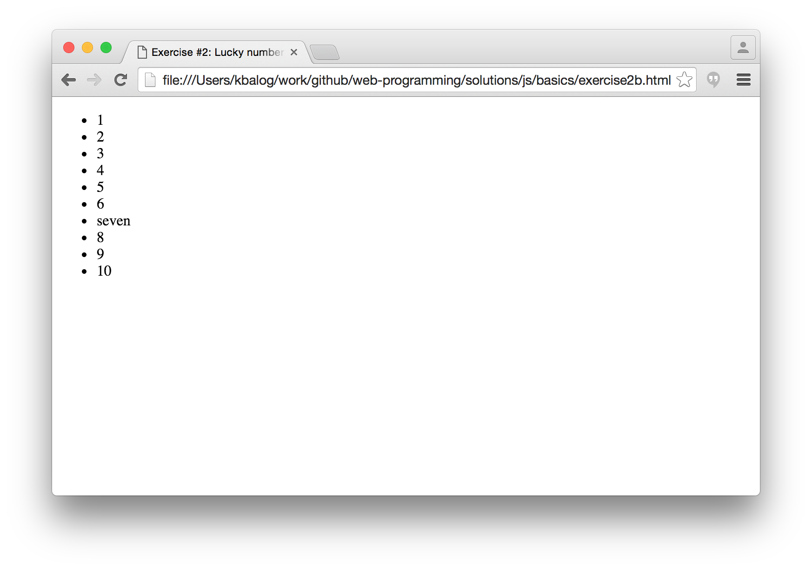
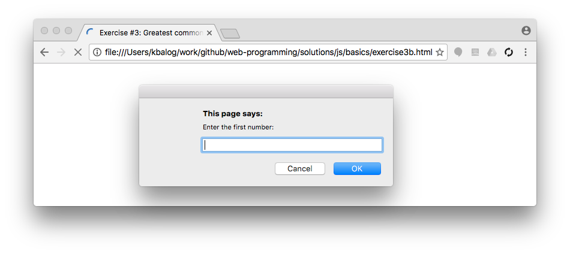
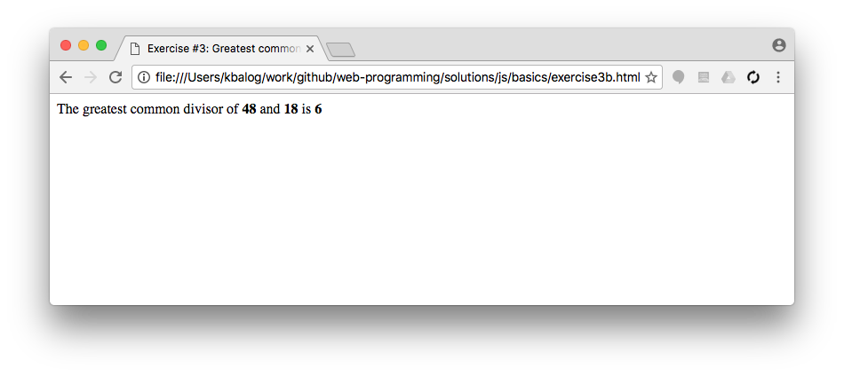
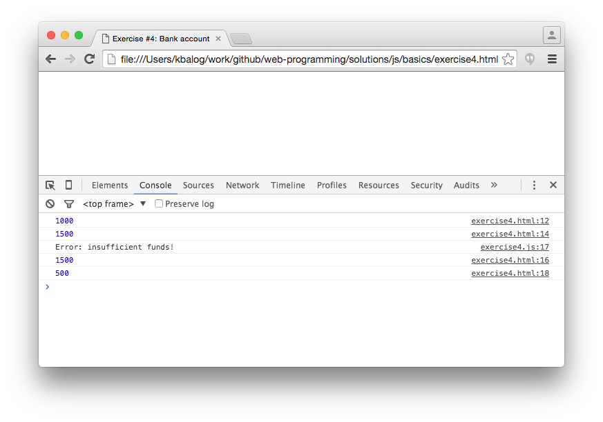
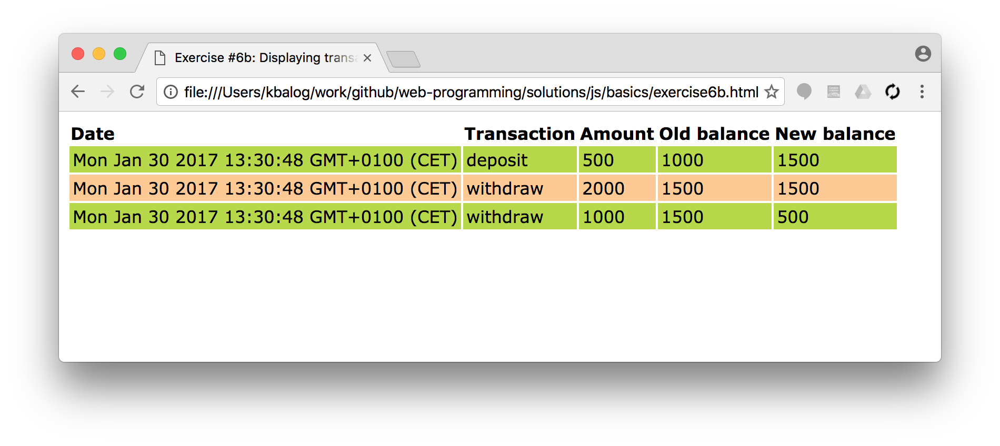

# JavaScript exercises, Part I. (basics)

## Exercise #1: Display options

Look at the different display examples and execute them by opening the files on your local computer.

  - [Writing into the browser console](/examples/js/basics/display_console.html)
  - [Writing into an alert box](/examples/js/basics/display_alert.html)
  - [Writing into the HTML output](/examples/js/basics/display_document.html)

## Exercise #2: Lucky number seven

  - Create a HTML page with a `` in the body part of your document.

## Exercise #3: Greatest common divisor

  - Write a function `gcd(a,b)` that takes two integers as input and returns their greatest common divisor.
  - The simplest implementation is using [Euclid's algorithm](https://en.wikipedia.org/wiki/Euclidean_algorithm#Implementations).
  - Call the function with values 48 and 18 and write the output to the console.

## Exercise #3b: Prompting values

  - Extend the previous exercise such that the integers `a` and `b` are entered by  the user.  Use the [prompt()](http://www.w3schools.com/jsref/met_win_prompt.asp) method for reading in the values.
  - Write the result to the document.
  - Pro: Extend the code so that only valid integers with a value greater than zero are accepted as input.  (Keep prompting for a number until it is valid.)

## Exercise #4: Bank account

  - Create a `BankAccount` class.
  - The constructor takes two variables: name and initial balance.
  - The class has two methods: `deposit(amount)` and `withdraw(amount)`.
  - Upon withdrawal check if the person has sufficient funds (and display an error message if not).
  - Write all JS code to the `exercise4.js` file. The HTML file [exercise4.html](exercise4.html) contains code for testing your class. (Use the web developer console of the browser to see the output.)

## Exercise #5: String reversal

  - Write a `reverse(s)` function that reverses the input string s.
  - For example, `reverse("test string")` should return `"gnirts tset"`.

## Exercise #6: Bank account with logging

  - Extend the BankAccount class from Exercise #4 such that all transactions are logged.
  - For each transaction, store date, transaction (deposit/withdrawal), old balance, new balance, and whether the transaction was successful.
  - Use the built-in Array and Date classes.

## Exercise #6b: Displaying transaction log

  - Extend the previous exercise such that the transaction log is displayed in a HTML table (as opposed to writing it to the console).
  - Use CSS to style the table.

