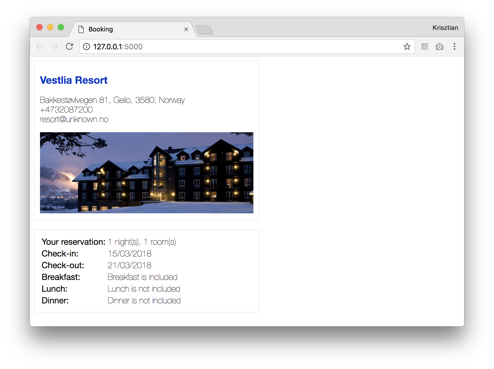
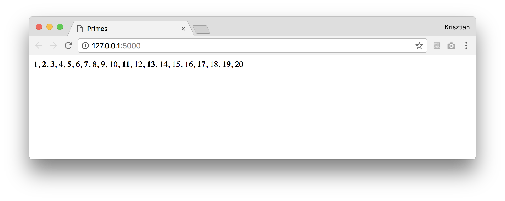
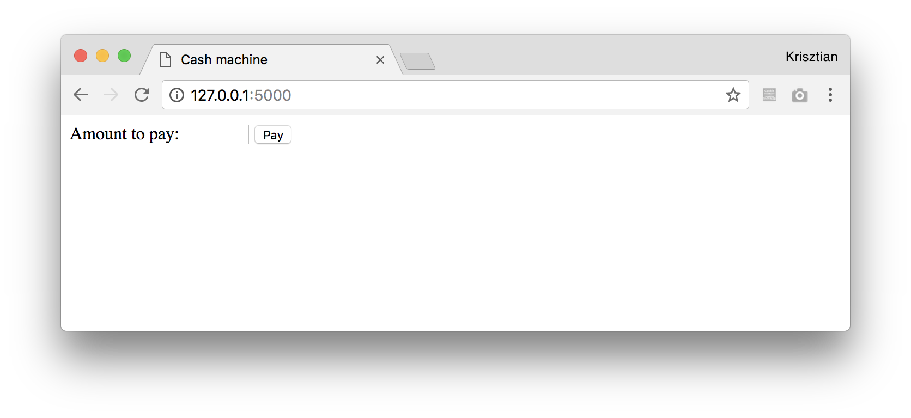
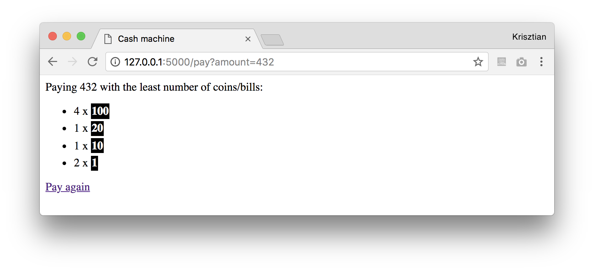
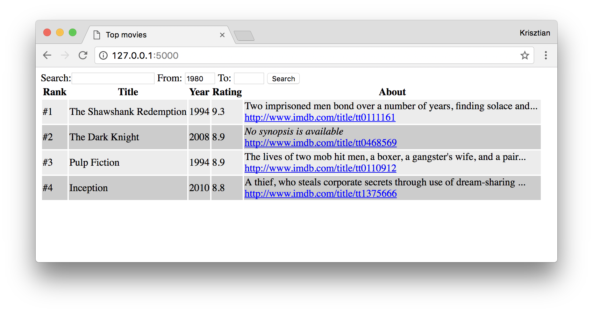

# Server Side Programming exercises (Python, Flask), Part II.

  * [Jinja documentation](http://jinja.pocoo.org/docs/2.10/templates/)
  * You need to run the `app.py` python file in the given exercise folder and see the output on [http://127.0.0.1:5000/](http://127.0.0.1:5000/). Note that you will need to re-start the app each time you make changes to the template file.
    - If you don't want to re-start the application each time, you can turn on debug mode by adding the line `app.debug = True` after `app = Flask(__name__)`

## Exercise #1: Booking

Complete the missing parts of `app.py` and `booking.html` (under [ex_1](ex_1/)) such that the details of a booking are displayed as shown below.

## Exercise #2: Primes

List the numbers between 1 and 20, with prime numbers typeset in boldface.

## Exercise #3: Cash machine

Given an input value (amount to pay), your task is to figure out how to pay that amount with the smallest possible number of bills/coins.

  * The available bills/coins are defined as a list `VALUES = [1, 5, 10, 20, 50, 100, 500]`
  * You need to optimize for using the minimal number of bills/coins
  * You're not given any starter files for this exercise

## Exercise #4: Top movies

Complete the `ex_4/templates/movies.html` template file such that information about movies is displayed in a table as seen below.  

Specifically:

  * Sort movies by rating.
  * Show the rank in the first column.
  * The synopsis should be limited to 80 characters. If no synopsis is available display the text "No synopsis is available" in italics.
  * Make the URLs clickable links. The link should open in a new window.
  * Alternate between background colors `#ECECEC` and `#CCCCCC` for even and odd rows.

**You need to complete this exercise without making any changes to the `app.py` file!**

## Exercise #4b: Movie search

Extend the previous exercise with search capability.  The input form has already been added to the [starting files](ex_4b/).

  * Return only movies that contain the keywords (given in the search input field) in their title or synopsis. If there are multiple keywords, return only those movies that contain all keywords (check matches case-insensitively).
  * If *From* or *To* are provided, return only movies within the specified time period.
  * When displaying the results, the page should also "remember" the form values that were filled in by the user.
  * If no filters are provided, return all movies.

