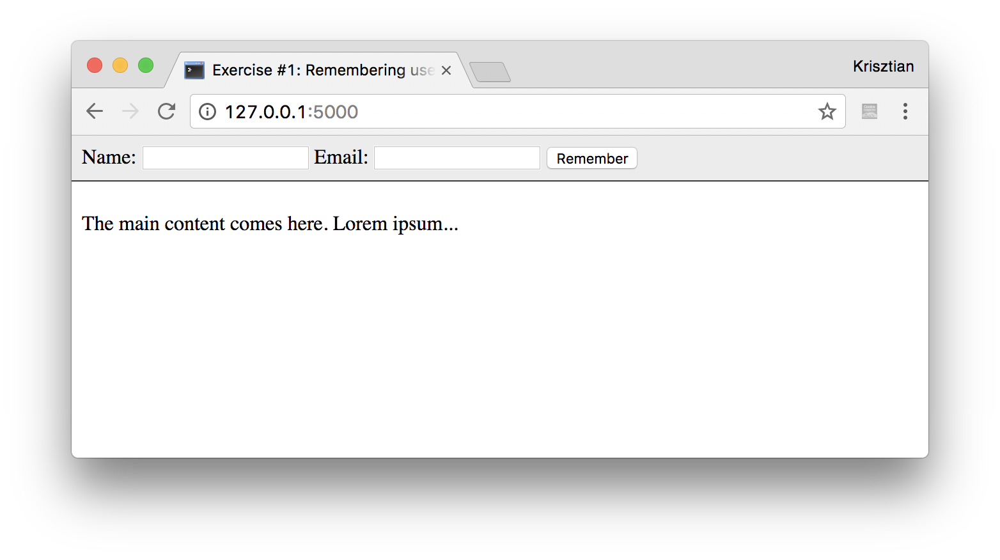
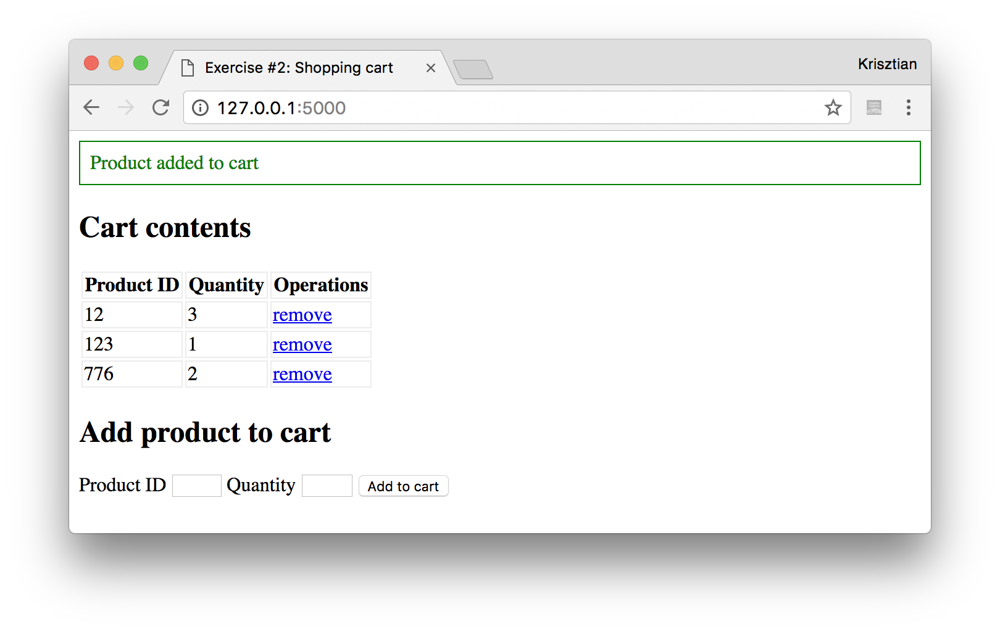
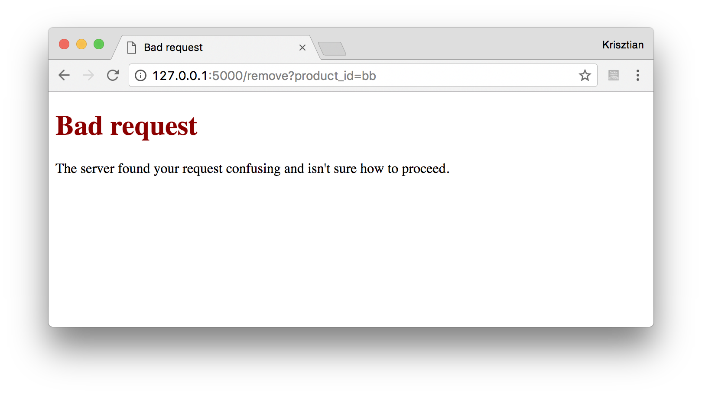
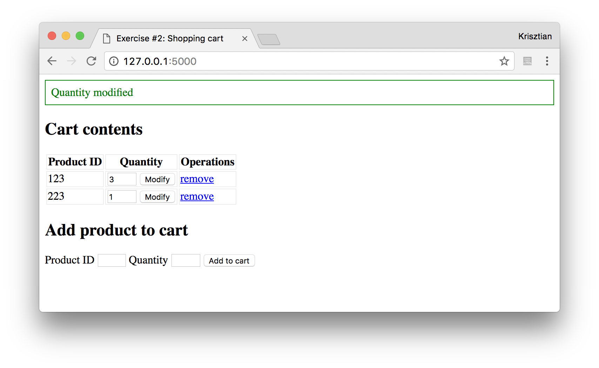

# Server Side Programming exercises (Python, Flask), Part IV.

  * [Flask QuickStart](http://flask.pocoo.org/docs/0.12/quickstart/)
  * [Jinja Templates](http://jinja.pocoo.org/docs/2.9/templates/)

## Exercise #1: Remembering user details

Make a form that asks for the user's name and email address, and then remembers the values using cookies.

  * Check (in the python code) if both name and email are provided. If not, display an error message.  
  * Remember the user's details for 60 days.
  * The user should also be able to "be forgotten" by clicking on a link.
  * Upon successful operations (remembering or forgetting), show a success message.
  * Use [message flashing](http://flask.pocoo.org/docs/0.12/patterns/flashing/#message-flashing-pattern) with `success` and `error` categories for displaying these messages.  The messages should be displayed inside the `<main>` element, above the content part. The style definitions are already created for the `success` and `error` classes.

The [skeleton of the app](ex_1/) is provided, which already includes the form that asks for the name and email and methods for the requests (to be completed).

Visiting http://127.0.0.1:5000/ **before** the user's details are remembered:

Visiting http://127.0.0.1:5000/ **after** the user's details are remembered:

## Exercise #2: Shopping cart

The task is to manage the contents of a shopping cart using sessions.

  * List the contents of the shopping cart.
  * Add a new product to the shopping cart.
    - Adding is done via a form that uses a POST method.
    - If the product is already in the shopping cart, increase its quantity.
    - Return a `400` (Bad Request) HTTP error if product ID or quantity are missing. Otherwise show a success message.
  * Remove a given product that is in the shopping cart.
    - Removing products is done via a GET request (`/remove?product_id=xxx`).
    - If the product to be removed is not in the shopping cart, then return a `400` HTTP error. Otherwise show a success message.
  * Create a custom error page for error `400`.

The [skeleton of the app](ex_2/) is provided, which already includes the HTML parts and a Python class for representing the shopping cart.  Complete the missing parts of `app.py` and make the necessary changes under `templates/`.

  * Hint: save the contents of the shopping cart in the session, that is, the dict that is returned by `contents()`. When loading the cart's contents from the session, initialize the ShoppingCart class with what is stored in the session.

## Exercise #2b: Shopping cart

Extend the previous exercise such that the user can modify the quantities in the cart.

